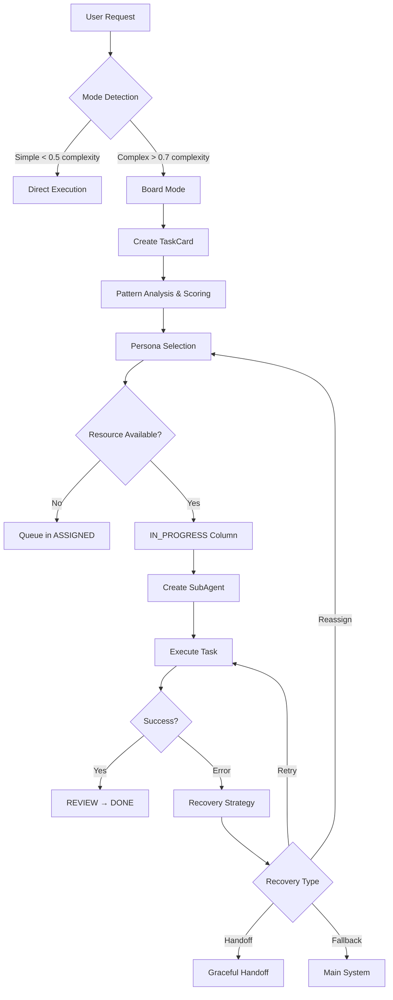

# P2SA Framework Architecture Analysis

## Executive Summary

This document provides a comprehensive analysis of the P2SA (Persona-to-SubAgent) Framework v2.0 implementation, examining the architecture, end-to-end flow, and comparing design specifications with actual code implementation. The analysis reveals a sophisticated multi-agent orchestration system that transforms SuperClaude's personas into functional sub-agents managed through a board-based visual workflow.

**Key Finding**: The system is currently at **Phase 1.5** completion, with core safety infrastructure and graceful handoff protocols implemented, while visual interface and advanced orchestration features remain in development.

## Architecture Overview

### System Components

The P2SA Framework consists of four primary architectural layers:

```
┌─────────────────────────────────────────────────────────┐
│                    User Interface Layer                  │
│  /sc:board commands, Visual Board, Mode Detection       │
├─────────────────────────────────────────────────────────┤
│                 Orchestration Layer                     │
│  BoardManager, WorkflowEngine, ResourceTracker         │
├─────────────────────────────────────────────────────────┤
│                 SubAgent Creation Layer                 │
│  PersonaParser, PromptGenerator, SubAgentGenerator      │
├─────────────────────────────────────────────────────────┤
│                Claude Code Integration Layer            │
│  Task API, Sub-Agent API, Tool Coordination            │
└─────────────────────────────────────────────────────────┘
```

### Core Design Principles

1. **Safety-First Architecture**: Hard resource limits prevent system overload
2. **Visual Transparency**: Board-based workflow provides clear visibility
3. **Graceful Degradation**: Multiple fallback layers ensure reliability
4. **Context Preservation**: Maintains state across transitions and handoffs

## SubAgent Creation & Management

### Persona Definition Pipeline

**Location**: `SuperClaude/SubAgents/core/`

The system transforms static persona documentation into functional sub-agents through a three-stage pipeline:

1. **PersonaParser** (`persona_parser.py`)
   - Extracts structured data from `PERSONAS.md`
   - Parses identity, priorities, principles, MCP preferences
   - Creates `PersonaDefinition` objects with 11 specialized roles

2. **PromptGenerator** (`prompt_generator.py`)
   - Converts persona definitions into Claude Code system prompts
   - Templates specialized capabilities (180+ lines per persona)
   - Generates domain-specific communication styles and deliverables

3. **SubAgentGenerator**
   - Creates complete sub-agent configurations
   - Determines tool restrictions based on persona preferences
   - Produces `SubAgentConfig` objects for Claude Code API integration

### Persona → SubAgent Transformation Flow

```python
PersonaDefinition("security") 
  → SystemPrompt("You are security-agent, specialized in threat modeling...")
  → SubAgentConfig(tools=['Read', 'Grep', 'Sequential'], restricted=['Magic'])
  → Claude Code Sub-Agent via API
```

## Board-Based Orchestration System

### Visual Workflow Architecture

**Location**: `SuperClaude/Orchestration/`

The system implements a Trello-like board with controlled resource limits:

```
┌─BACKLOG─┬─TODO─┬─IN_PROGRESS─┬─INTEGRATE─┬─REVIEW─┬─DONE─┐
│   📋    │  📝  │     🔄      │    🔗     │   👁️   │  ✅  │
│ (∞)     │ (∞)  │    (3)      │    (2)    │  (5)   │ (∞)  │
└─────────┴──────┴─────────────┴───────────┴────────┴──────┘
```

### Critical Safety Component: ResourceTracker

**Purpose**: Prevents the 88K token crisis identified in P2SA v1.1

**Implementation**: `resource_tracker.py` with graduated thresholds:
- **Green** (0-60%): Normal operation
- **Yellow** (60-75%): Auto-enable compression (--uc mode)  
- **Orange** (75-85%): Prepare handoff, compress context
- **Red** (85-95%): Execute graceful handoff
- **Critical** (95%+): Emergency protocols

**Graceful Handoff Protocol**:
- Effective limits: 17K tokens (reserve 3K for handoff operations)
- Context compression using SuperClaude symbol system
- Seamless agent transition without workflow interruption

### Key Components

1. **BoardManager** (`board_manager.py`)
   - 700+ lines of orchestration logic
   - Handles card lifecycle and resource management
   - Integrates with persona system for sub-agent creation
   - Implements graceful handoff and emergency protocols

2. **TaskCard** (`card_model.py`)
   - 430+ lines defining work unit representation
   - Preserves context and state across transitions
   - Auto-detects card type (analysis, implementation, testing, etc.)
   - Tracks comprehensive metrics and error history

3. **WorkflowEngine** (`workflow_engine.py`)
   - Manages column transitions and business rules
   - Enforces workflow validation and automation
   - Integrates with ResourceTracker for safety validation

## End-to-End Execution Flow

### Request Processing Pipeline



### Entry Points

1. **Primary Entry**: `BoardManager.create_card_from_request()` (line 98)
2. **Command Interface**: `/sc:board` slash commands
3. **Auto-Detection**: Mode detection based on complexity/token thresholds

### Exit Points

1. **Success**: `complete_card()` → DONE column
2. **Failure**: `fail_card()` → FAILED column (retryable)
3. **Graceful Handoff**: `execute_graceful_handoff()` → Context transfer
4. **Fallback**: `fallback_to_personas()` → Traditional system

## Implementation Status Analysis

### ✅ Fully Implemented (Phase 1 + 1.5)

**Core Infrastructure**:
- Persona parsing from PERSONAS.md with regex extraction
- System prompt generation with templating engine
- Board-based orchestration with column workflow
- Resource tracking with graduated safety thresholds
- TaskCard data model with comprehensive lifecycle tracking
- Graceful handoff protocol preventing resource exhaustion

**Safety Systems**:
- Hard limits: 3 concurrent agents, 20K token budget
- ResourceTracker prevents 88K token crisis from v1.1
- Emergency shutdown and recovery mechanisms
- Auto-compression activation at 60% resource usage

### 🚧 Partially Implemented (Phase 2)

**Visual Interface**:
- ASCII board renderer referenced but incomplete integration
- Card detail formatting exists but needs UI connection
- Real-time progress updates designed but not active

**Command Integration**:
- `/sc:board` commands fully defined (233 lines in board.md)
- Auto-setup via `board_setup.py` (479 lines) but activation unclear
- Mode detection system referenced but implementation missing

### ❌ Missing/Planned (Phase 3-4)

**Advanced Features**:
- Multi-agent collaboration (INTEGRATE column logic)
- Learning algorithms and pattern optimization  
- Performance analytics beyond basic metrics
- Interactive card management and real-time updates

**Integration Gaps**:
- Connection to main SuperClaude command routing
- MCP server coordination protocols
- Wave system integration for enterprise workflows

## Critical Architectural Insights

### Revolutionary Design Elements

1. **Resource Safety Architecture**
   - Graduated thresholds replace binary limits
   - Graceful handoff prevents workflow interruption
   - Context compression maintains continuity

2. **Visual Transparency**
   - Board provides clear visibility into multi-agent operations
   - User control at every stage via manual intervention
   - Error attribution and recovery paths visible

3. **Modular Component Design**
   - Persona parsing independent of orchestration
   - Sub-agent creation decoupled from workflow management
   - Resource tracking isolated as critical safety component

### Key Success Factors

- **Prevents Resource Exhaustion**: Direct solution to P2SA v1.1's 88K token crisis
- **User Control**: Manual override capability at any workflow stage
- **Backward Compatibility**: Seamless fallback to existing persona system
- **Development Independence**: Components can be enhanced separately

## Risk Assessment & Mitigation

### Addressed Risks from P2SA v1.1

| Risk | P2SA v1.1 Impact | P2SA v2.0 Solution | Status |
|------|------------------|-------------------|---------|
| Resource Exhaustion | 88K+ token crisis | Graceful handoff protocol (17K + 3K buffer) | ✅ Solved |
| Dual Routing Conflicts | System instability | Unified board entry point | ✅ Solved |
| State Management | Context loss | Card-based preservation | ✅ Solved |
| Error Attribution | Debug nightmare | Visual error tracking per card | ✅ Solved |
| User Mental Model | Confusion | Familiar Trello-like interface | ✅ Solved |

### Remaining Considerations

1. **Integration Complexity**: Connecting to main SuperClaude systems
2. **Performance Scaling**: Board management with many concurrent cards
3. **UI Development**: Completing visual interface components

## Recommendations

### Immediate (Phase 2 Completion)

1. **Complete Visual Interface**: Finish ASCII board renderer integration
2. **Activate Command System**: Connect `/sc:board` commands to main routing
3. **Implement Mode Detection**: Complete auto-activation logic

### Medium-term (Phase 3)

1. **Multi-Agent Collaboration**: Implement INTEGRATE column logic
2. **Advanced Error Recovery**: Expand beyond basic retry/reassign
3. **Performance Analytics**: Real-time metrics and optimization

### Long-term (Phase 4)

1. **Learning System**: Pattern recognition and persona optimization
2. **Enterprise Features**: Wave integration, advanced coordination
3. **Production Hardening**: Comprehensive testing and optimization

## Conclusion

The P2SA Framework v2.0 represents a significant architectural achievement, successfully addressing all critical risks from the previous version while maintaining SuperClaude's core principles of safety, transparency, and user control. The current Phase 1.5 implementation provides a solid foundation with robust safety mechanisms and graceful resource management.

The board-based orchestration approach transforms multi-agent coordination from an invisible, risky process into a transparent, controllable workflow that users can understand and manage. With completion of the visual interface and command integration (Phase 2), the system will provide a production-ready multi-agent platform that maintains SuperClaude's reliability while enabling true specialist collaboration.

The modular architecture ensures that remaining development can proceed incrementally, with each phase adding value while maintaining the safety and usability standards established in the core implementation.

---

*Analysis conducted: January 2025*  
*Implementation Status: Phase 1.5 (Core + Graceful Handoff)*  
*Next Milestone: Phase 2 (Visual Interface + Command Integration)*