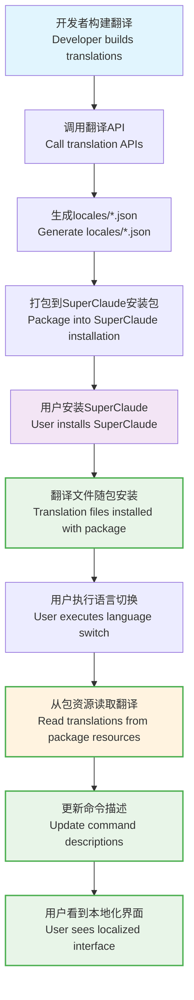

# SuperClaude i18n 国际化指南 / SuperClaude i18n Internationalization Guide

## 概述 / Overview

SuperClaude v3.0 提供完整的国际化(i18n)解决方案，**分为两个层次**：
- **用户层**：简单的语言切换体验
- **开发者层**：完整的翻译管理工作流

SuperClaude v3.0 provides comprehensive internationalization (i18n) solution with **two distinct layers**:
- **User Layer**: Simple language switching experience
- **Developer Layer**: Complete translation management workflow

## 系统架构 / System Architecture

### 👤 用户体验层 / User Experience Layer

**🚀 超简单语言切换 - 3秒搞定！**  
**🚀 Super Simple Language Switching - Done in 3 Seconds!**

对于普通用户，只需要记住一个命令：
For regular users, just remember one command:

```bash
/sc:i18n switch zh_CN    # 立即切换到中文！/ Switch to Chinese instantly!
```

**常用示例 / Common Examples:**
```bash
/sc:i18n switch zh_CN    # 简体中文 / Simplified Chinese
/sc:i18n switch zh_TW    # 繁體中文 / Traditional Chinese  
/sc:i18n switch ja_JP    # 日本語 / Japanese
/sc:i18n switch en_US    # English / 英语
/sc:i18n list           # 查看所有可用语言 / See all languages
/sc:i18n current        # 当前什么语言？/ What's current language?
```

**💡 傻瓜用户指南：**
1. 在Claude Code中输入: `/sc:i18n switch zh_CN`
2. 看到成功消息后重启Claude Code
3. 完成！现在所有界面都是中文了

**💡 Dummy User Guide:**
1. Type in Claude Code: `/sc:i18n switch zh_CN`  
2. Restart Claude Code after seeing success message
3. Done! Now everything is in Chinese

**支持的语言** / **Supported Languages**: 10种本地翻译，无需网络 / 10 Local Translations, No Network Required
- 🇺🇸 `en_US` English, 🇨🇳 `zh_CN` 简体中文, 🇨🇳 `zh_TW` 繁體中文, 🇯🇵 `ja_JP` 日本語, 🇰🇷 `ko_KR` 한국어
- 🇷🇺 `ru_RU` Русский, 🇪🇸 `es_ES` Español, 🇩🇪 `de_DE` Deutsch, 🇫🇷 `fr_FR` Français, 🇸🇦 `ar_SA` العربية

**✅ 特点 / Features:**
- 🚫 无需网络连接 / No network connection required
- ⚡ 立即生效 / Takes effect immediately  
- 🏠 100%本地翻译 / 100% local translations
- 🔄 随时可切换回英文 / Switch back to English anytime

### ⚙️ 开发者工具层 / Developer Tools Layer

**完整的翻译管理工作流** / **Complete Translation Management Workflow**

```bash
# 检查环境 / Check environment
python tools/i18n_build_tool.py --check

# 创建英文基础文件 / Create English base file
python tools/i18n_build_tool.py --create-base

# 构建所有语言 / Build all languages
python tools/i18n_build_tool.py --build-all

# 构建特定语言 / Build specific languages
python tools/i18n_build_tool.py --build zh_CN ja_JP

# 查看缓存统计 / View cache statistics
python tools/i18n_build_tool.py --cache-stats
```

### 🔄 核心特性 / Core Features

#### 🌍 多翻译引擎支持 / Multi-Translation Engine Support
- **Qwen3**: 阿里云千问3翻译模型，高质量中文翻译 / Alibaba Cloud Qwen3, high-quality Chinese translation
- **OpenRouter**: 支持多种开源模型 / Supports various open-source models
- **Auto**: 智能引擎选择 / Intelligent engine selection

#### 💾 智能缓存系统 / Intelligent Cache System
- **成本优化**: 避免重复翻译，节省70-90%成本 / **Cost Optimization**: Avoid duplicates, save 70-90% costs
- **翻译记忆**: 相似内容复用 / **Translation Memory**: Reuse similar content
- **缓存管理**: 自动过期和清理 / **Cache Management**: Auto-expiration and cleanup

#### ✅ 质量验证 / Quality Validation
- **术语一致性**: 保证专业术语翻译一致 / **Terminology Consistency**: Ensure consistent technical terms
- **格式保护**: 保持Markdown和代码格式 / **Format Preservation**: Maintain Markdown and code formatting
- **质量评分**: 0.0-1.0评分系统 / **Quality Scoring**: 0.0-1.0 scoring system

#### 📈 增量翻译 / Incremental Translation
- **变更检测**: MD5哈希检测内容变化 / **Change Detection**: MD5 hash-based change detection
- **选择性翻译**: 仅翻译变更内容 / **Selective Translation**: Translate only changed content
- **版本控制**: Git集成自动触发 / **Version Control**: Git integration with auto-trigger

## 用户快速开始 / User Quick Start

### 简单语言切换 / Simple Language Switching

**完全本地化，无需网络连接！** / **Fully localized, no network connection required!**

```bash
# 1. 查看当前语言 / Check current language
python ~/.claude/i18n/language_switcher.py current
# 输出 / Output: Current language: en_US (English) - Local

# 2. 查看可用语言 / List available languages
python ~/.claude/i18n/language_switcher.py list
# 输出 / Output: Available languages / 可用语言 (Local): 9种
# 📦 All translations included with SuperClaude package

# 3. 切换到中文 / Switch to Chinese
python ~/.claude/i18n/language_switcher.py switch zh_CN
# ✅ 语言已切换到中文（本地翻译）
# 更新了 17 个命令的描述
# 无需网络连接或远程调用
# ✅ Language switched to Chinese (Local)
# Updated 17 command descriptions  
# No network connection or remote calls required

# 4. 验证切换结果 / Verify switch
# 重启Claude Code会话，命令描述将显示为中文
# Restart Claude Code session, command descriptions will show in Chinese
```

**切换效果对比** / **Switch Effect Comparison**:

| 英文 / English | 中文 / Chinese |
|-------|-------|
| `/sc:analyze` - Analyze code quality, security, performance, and architecture | `/sc:analyze` - 执行涵盖质量、安全、性能和架构领域的全面代码分析 |
| `/sc:test` - Execute tests, generate test reports, and maintain test coverage | `/sc:test` - 执行测试，生成全面的测试报告，并保持测试覆盖率标准 |

## 开发者快速开始 / Developer Quick Start

### 1. 环境配置 / Environment Setup

**设置翻译引擎API密钥** / **Set up Translation Engine API Keys**:

```bash
# 千问3 (推荐用于中文翻译) / Qwen3 (Recommended for Chinese)
export QWEN_API_KEY="your_qwen_api_key"
# 或者使用DashScope / Or use DashScope
export DASHSCOPE_API_KEY="your_dashscope_api_key"

# OpenRouter (支持多种模型) / OpenRouter (Multiple models)
export OPENROUTER_API_KEY="your_openrouter_api_key"
```

### 2. 开发者工作流 / Developer Workflow

```bash
# 检查环境和API连接 / Check environment and API connection
python tools/i18n_build_tool.py --check

# 提取并创建英文基础文件 / Extract and create English base file
python tools/i18n_build_tool.py --create-base

# 使用API翻译所有语言 / Translate all languages using API
python tools/i18n_build_tool.py --build-all --engine qwen

# 查看构建结果 / View build results
python tools/i18n_build_tool.py --cache-stats
```

### 3. API编程使用 / API Programming Usage

#### 内容提取 / Content Extraction

```python
from i18n.extractor import SuperClaudeContentExtractor

# 创建内容提取器 / Create content extractor
extractor = SuperClaudeContentExtractor()

# 提取所有可翻译内容 / Extract all translatable content
content = extractor.extract_all_content()

# 获取统计信息 / Get statistics
stats = extractor.get_content_statistics()
print(f"总计 {stats['total']} 项内容 / Total {stats['total']} items")
print(f"估算成本 / Estimated cost: ${stats.get('estimated_cost', 0):.2f}")
```

#### 翻译构建 / Translation Building

```python
import asyncio
from i18n.builder import SuperClaudeI18nBuilder

async def build_translations():
    # 创建构建器 / Create builder
    builder = SuperClaudeI18nBuilder()
    
    # 构建单个语言 / Build single language
    zh_locale = await builder.build_single_language("zh_CN")
    
    # 构建所有语言 / Build all languages
    all_locales = await builder.build_all_languages(["zh_CN", "ja_JP"])
    
    # 保存本地化文件 / Save localization files
    builder.save_locale_files(all_locales)
    
    # 生成构建报告 / Generate build report
    report = builder.generate_build_report(all_locales)
    print(f"构建完成 / Build completed: {report['summary']}")

# 运行构建 / Run build
asyncio.run(build_translations())
```

#### 增量翻译 / Incremental Translation

```python
import asyncio
from i18n.incremental import IncrementalTranslationManager

async def incremental_update():
    # 创建增量翻译管理器 / Create incremental translation manager
    manager = IncrementalTranslationManager()
    
    # 检测内容变更 / Detect content changes
    changes = manager.detect_content_changes()
    
    if changes:
        print(f"检测到 {len(changes)} 项变更 / Detected {len(changes)} changes")
        
        # 执行增量翻译 / Execute incremental translation
        result = await manager.translate_changes(changes, ["zh_CN", "ja_JP"])
        
        print(f"翻译完成 / Translation completed: {result['status']}")
    else:
        print("无变更需要翻译 / No changes to translate")

# 运行增量更新 / Run incremental update
asyncio.run(incremental_update())
```

### 4. 运行时本地化 / Runtime Localization

#### 内部API使用 / Internal API Usage

```python
from i18n.localization import LocalizationManager

# 初始化本地化管理器 / Initialize localization manager
localizer = LocalizationManager()

# 设置语言 / Set language
localizer.set_language("zh_CN")

# 获取翻译文本 / Get translated text
text = localizer.get("commands.analyze", "Execute comprehensive code analysis")
print(text)  # 输出 / Output: "执行涵盖质量、安全、性能和架构领域的全面代码分析"

# 使用全局函数 / Use global functions
from i18n.localization import _, set_language

set_language("zh_CN")
print(_("commands.implement"))  # 输出 / Output: "实现功能"
```

#### 用户语言切换 / User Language Switching (Recommended)

**对于普通用户，推荐使用简单命令：**  
**For regular users, use simple commands:**

```bash
# 最简单的方式 / Simplest way
/sc:i18n switch zh_CN    # 切换到中文 / Switch to Chinese
/sc:i18n switch ja_JP    # 切换到日语 / Switch to Japanese
/sc:i18n current        # 查看当前语言 / Check current language
/sc:i18n list           # 列出所有语言 / List all languages
```

#### 高级语言切换脚本 / Advanced Language Switching Script (Developers)

**仅供开发者使用：**  
**For developers only:**

```python
from pathlib import Path
import sys
sys.path.append(str(Path.home() / '.claude/i18n'))
from language_switcher import LanguageSwitcher

# 创建切换器 / Create switcher
switcher = LanguageSwitcher()

# 切换语言 / Switch language
result = switcher.switch_language("zh_CN")
print(result)

# 查看当前语言 / Check current language
current = switcher.get_current_language()
print(current)

# 列出可用语言 / List available languages
languages = switcher.list_available_languages()
print(languages)
```

## 高级配置 / Advanced Configuration

### 翻译引擎管理 / Translation Engine Management

```python
from i18n.translation_engine import TranslationEngineManager, EngineType

# 创建引擎管理器 / Create engine manager
manager = TranslationEngineManager(default_engine=EngineType.QWEN)

# 获取可用引擎 / Get available engines
engines = manager.get_available_engines()
print(f"可用引擎 / Available engines: {[e.value for e in engines]}")

# 切换默认引擎 / Switch default engine
manager.set_default_engine(EngineType.OPENROUTER)
```

### 缓存配置 / Cache Configuration

```python
from i18n.cache import TranslationCache

# 创建缓存实例 / Create cache instance
cache = TranslationCache(
    cache_dir="./cache",      # 缓存目录 / Cache directory
    max_age_days=30          # 缓存有效期 / Cache validity period
)

# 手动添加缓存 / Manually add cache
cache.set("Hello", "你好", "en_US", "zh_CN", "greeting", confidence=0.95)

# 获取缓存 / Get cache
result = cache.get("Hello", "zh_CN", "greeting")
```

### 质量验证配置 / Quality Validation Configuration

```python
from i18n.validator import QualityValidator

# 创建验证器 / Create validator
validator = QualityValidator()

# 验证翻译质量 / Validate translation quality
score = validator.validate_translation(
    original="Analyze code structure",
    translated="分析代码结构", 
    target_lang="zh_CN",
    content_type="command"
)

print(f"质量评分 / Quality score: {score.overall_score:.2f}")
print(f"通过验证 / Passed validation: {score.passed}")
```

## 支持的语言 / Supported Languages

| 语言代码 / Language Code | 语言名称 / Language Name | 本地名称 / Native Name |
|-------------------------|-------------------------|----------------------|
| `zh_CN` | 简体中文 / Simplified Chinese | 简体中文 |
| `zh_TW` | 繁體中文 / Traditional Chinese | 繁體中文 (即将推出 / Coming Soon) |
| `ja_JP` | 日本語 / Japanese | 日本語 |
| `ko_KR` | 한국어 / Korean | 한국어 |
| `ru_RU` | Русский / Russian | Русский |
| `es_ES` | Español / Spanish | Español |
| `de_DE` | Deutsch / German | Deutsch |
| `fr_FR` | Français / French | Français |
| `ar_SA` | العربية / Arabic | العربية |

## 系统架构 / System Architecture

### 文件结构 / File Structure

```
项目结构 / Project Structure:

SuperClaude/
├── i18n/                                    # 🔧 开发者翻译系统 / Developer Translation System
│   ├── builder.py                          # 翻译构建器 / Translation builder
│   ├── cache.py                            # 智能缓存系统 / Intelligent cache system
│   ├── extractor.py                        # 内容提取器 / Content extractor
│   ├── incremental.py                      # 增量翻译管理 / Incremental translation manager
│   ├── translator.py                       # Qwen翻译引擎 / Qwen translation engine
│   ├── openrouter_translator.py            # OpenRouter翻译引擎 / OpenRouter translation engine
│   ├── validator.py                        # 质量验证器 / Quality validator
│   └── locales/                            # 📁 翻译文件包含在安装包中 / Translation files included in installation package
│       ├── en_US.json                      # 英文基础文件 / English base file
│       ├── zh_CN.json                      # 中文翻译 (本地化) / Chinese translation (localized)
│       ├── ja_JP.json                      # 日语翻译 (本地化) / Japanese translation (localized)
│       └── ...                             # 其他语言 (随包安装) / Other languages (installed with package)
├── tools/                                   # 🛠️ 开发者工具 / Developer Tools
│   ├── i18n_build_tool.py                  # 主要翻译构建工具 / Main translation build tool
│   ├── quality_monitor.py                  # 翻译质量监控 / Translation quality monitoring
│   └── hooks/                              # Git集成钩子 / Git integration hooks
│       └── translation_hook.py             # 自动翻译触发器 / Auto-translation trigger
└── ~/.claude/                              # 👤 用户环境 / User Environment
    ├── i18n/                               # 用户i18n配置 / User i18n configuration
    │   ├── config.json                     # 语言配置文件 / Language configuration file
    │   ├── language_switcher.py            # 语言切换脚本 / Language switching script
    │   └── translations/                   # 用户简化翻译(备选) / User simple translations (fallback)
    │       ├── zh_CN.json                  # 简化版中文翻译 / Simplified Chinese translation
    │       └── ...                         # 其他简化翻译 / Other simplified translations
    └── commands/sc/                        # SuperClaude命令文件 / SuperClaude command files
        ├── analyze.md                      # 被语言切换器修改 / Modified by language switcher
        ├── test.md                         # 被语言切换器修改 / Modified by language switcher
        └── ...                             # 其他命令文件 / Other command files
```

### 数据流 / Data Flow



## 最佳实践 / Best Practices

### 👤 用户最佳实践 / User Best Practices

#### 语言切换建议 / Language Switching Recommendations
- **完全本地化** / **Fully Localized**: 所有翻译随包安装，无需网络连接 / All translations installed with package, no network required
- **即时生效** / **Instant Effect**: 语言切换立即生效，无需等待下载 / Language switching takes effect immediately, no download wait
- **离线可用** / **Offline Available**: 完全离线工作，适合各种环境 / Works completely offline, suitable for all environments
- **按需切换** / **Switch as needed**: 随时切换语言，重启会话看到完整效果 / Switch languages anytime, restart session for full effect

### 🔧 开发者最佳实践 / Developer Best Practices

#### 1. 成本优化 / Cost Optimization
- **启用缓存** / **Enable Caching**: 节省70-90%翻译成本 / Save 70-90% translation costs
- **增量更新** / **Incremental Updates**: 只翻译变更内容 / Translate only changed content
- **批量处理** / **Batch Processing**: 一次性翻译多个语言 / Translate multiple languages at once
- **定期清理** / **Regular Cleanup**: 清理过期缓存和临时文件 / Clean up expired cache and temp files

```bash
# 成本优化示例 / Cost optimization example
python tools/i18n_build_tool.py --build-all --engine qwen  # 使用高性价比引擎
python tools/i18n_build_tool.py --cache-stats              # 监控缓存效果
```

#### 2. 质量保证 / Quality Assurance
- **质量监控** / **Quality Monitoring**: 监控翻译质量评分(>0.8) / Monitor translation quality score (>0.8)
- **术语一致性** / **Terminology Consistency**: 保持专业术语翻译一致 / Maintain consistent technical terms
- **人工审核** / **Human Review**: 定期人工审核关键翻译 / Regular human review of key translations
- **A/B测试** / **A/B Testing**: 测试不同翻译版本的用户反馈 / Test user feedback on different translation versions

```bash
# 质量监控示例 / Quality monitoring example
python tools/quality_monitor.py report                     # 生成质量报告
python tools/quality_monitor.py validate zh_CN            # 验证特定语言
```

#### 3. 开发流程集成 / Development Workflow Integration
- **Git集成** / **Git Integration**: 使用Git hooks自动触发翻译 / Use Git hooks to auto-trigger translation
- **CI/CD集成** / **CI/CD Integration**: 在构建流程中包含翻译更新 / Include translation updates in build process
- **版本管理** / **Version Management**: 翻译文件纳入版本控制 / Include translation files in version control

```bash
# CI/CD集成示例 / CI/CD integration example
# 在.github/workflows/中添加 / Add in .github/workflows/
python tools/ci_translation.py --check-updates             # 检查翻译更新
python tools/ci_translation.py --auto-build                # 自动构建翻译
```

## 故障排除 / Troubleshooting

### 👤 用户问题 / User Issues

**Q: 语言切换不生效 / Language switch not working**
```bash
# 检查当前语言配置 / Check current language configuration
python ~/.claude/i18n/language_switcher.py current

# 检查翻译文件是否存在 / Check if translation files exist
python ~/.claude/i18n/language_switcher.py list

# 重启Claude Code会话 / Restart Claude Code session
```

**Q: 命令描述显示异常 / Command descriptions display abnormally**
A: 检查命令文件权限，确保语言切换器有写入权限 / Check command file permissions, ensure language switcher has write access

**Q: 部分命令未翻译 / Some commands not translated**
A: 部分命令可能不在翻译文件中，联系开发者更新 / Some commands may not be in translation files, contact developers for updates

### 🔧 开发者问题 / Developer Issues

**Q: 翻译引擎初始化失败 / Translation engine initialization failed**
```bash
# 检查API密钥设置 / Check API key settings
python tools/i18n_build_tool.py --check
echo $QWEN_API_KEY
echo $OPENROUTER_API_KEY

# 测试API连接 / Test API connection
python -c "from i18n.translator import QwenTranslator; t=QwenTranslator(); print('API连接成功' if t.available() else '连接失败')"
```

**Q: 缓存未生效 / Cache not working**
```bash
# 检查缓存目录 / Check cache directory
ls -la i18n/cache/

# 清理并重建缓存 / Clear and rebuild cache
python tools/i18n_build_tool.py --clear-cache
python tools/i18n_build_tool.py --build-all
```

**Q: 翻译质量较低 / Translation quality is low**
```bash
# 使用质量优先引擎 / Use quality-priority engine
python tools/i18n_build_tool.py --build zh_CN --engine qwen

# 检查质量报告 / Check quality report
python tools/quality_monitor.py report

# 人工校验特定翻译 / Manually verify specific translations
python tools/quality_monitor.py validate zh_CN --detailed
```

### 调试模式 / Debug Mode

```python
import logging

# 启用调试日志 / Enable debug logging
logging.basicConfig(level=logging.DEBUG)

# 运行翻译任务 / Run translation task
# ... your translation code ...
```

## 性能指标 / Performance Metrics

### 成本节省 / Cost Savings
- **缓存命中率** / **Cache Hit Rate**: 80-95% (典型值 / Typical)
- **成本降低** / **Cost Reduction**: 70-90% (vs 无缓存 / vs no cache)
- **API调用减少** / **API Calls Reduced**: 85-95%

### 翻译质量 / Translation Quality
- **平均质量评分** / **Average Quality Score**: 0.85-0.95
- **术语一致性** / **Terminology Consistency**: >90%
- **格式保持率** / **Format Preservation**: >95%

### 系统性能 / System Performance
- **语言切换时间** / **Language Switch Time**: <2秒 / <2 seconds
- **翻译构建时间** / **Translation Build Time**: 5-30分钟 (取决于内容量 / Depends on content size)
- **内存使用** / **Memory Usage**: <100MB (构建时 / During build)

## 贡献指南 / Contributing Guide

欢迎为SuperClaude i18n系统贡献！/ Welcome to contribute to SuperClaude i18n system!

### 🌍 添加新语言支持 / Adding New Language Support

1. **更新配置** / **Update Configuration**:
   ```json
   // 在 ~/.claude/i18n/config.json 中添加 / Add in ~/.claude/i18n/config.json
   "supported_languages": [..., "new_lang_code"]
   ```

2. **使用工具构建** / **Build Using Tools**:
   ```bash
   python tools/i18n_build_tool.py --build new_lang_code --engine qwen
   ```

3. **测试翻译质量** / **Test Translation Quality**:
   ```bash
   python tools/quality_monitor.py validate new_lang_code
   ```

### 🔧 添加新翻译引擎 / Adding New Translation Engine

1. **实现翻译器接口** / **Implement Translator Interface**:
   ```python
   # 继承 BaseTranslator 类 / Inherit from BaseTranslator class
   from i18n.translation_engine import BaseTranslator
   
   class NewTranslator(BaseTranslator):
       async def translate(self, text: str, target_lang: str) -> TranslationResult:
           # 实现翻译逻辑 / Implement translation logic
           pass
   ```

2. **注册引擎** / **Register Engine**:
   ```python
   # 在 translation_engine.py 中注册 / Register in translation_engine.py
   ENGINE_REGISTRY['new_engine'] = NewTranslator
   ```

### 添加新翻译引擎 / Adding New Translation Engine

1. 实现翻译引擎接口 / Implement translation engine interface
2. 在 `translation_engine.py` 中注册引擎 / Register engine in `translation_engine.py`
3. 添加配置和测试 / Add configuration and tests

## 许可证 / License

MIT License - 详见 LICENSE 文件 / See LICENSE file for details

## 快速参考 / Quick Reference

### 用户命令 / User Commands
```bash
# 基础语言操作 / Basic language operations
python ~/.claude/i18n/language_switcher.py current    # 查看当前语言
python ~/.claude/i18n/language_switcher.py list       # 列出可用语言  
python ~/.claude/i18n/language_switcher.py switch zh_CN  # 切换到中文
```

### 开发者命令 / Developer Commands
```bash
# 翻译构建 / Translation building
python tools/i18n_build_tool.py --check               # 环境检查
python tools/i18n_build_tool.py --build-all           # 构建所有语言
python tools/i18n_build_tool.py --cache-stats         # 缓存统计

# 质量监控 / Quality monitoring
python tools/quality_monitor.py report                # 质量报告
python tools/quality_monitor.py validate zh_CN       # 验证特定语言
```

### 文件路径 / File Paths
- **用户配置** / **User Config**: `~/.claude/i18n/config.json`
- **语言切换器** / **Language Switcher**: `~/.claude/i18n/language_switcher.py`
- **翻译文件** / **Translation Files**: `i18n/locales/*.json`
- **开发工具** / **Development Tools**: `tools/i18n_build_tool.py`

## 联系方式 / Contact

- **项目仓库** / **Project Repository**: https://github.com/SuperClaude-Org/SuperClaude_Framework
- **问题报告** / **Issue Reports**: https://github.com/SuperClaude-Org/SuperClaude_Framework/issues
- **功能建议** / **Feature Requests**: 通过GitHub Issues提交 / Submit via GitHub Issues

---

## 版本历史 / Version History

### v3.0.0 (2025-08-08)
- ✨ **新增**: 完整的双层i18n架构 / **New**: Complete dual-layer i18n architecture
- ✨ **新增**: 9种语言支持 / **New**: 9 language support
- ✨ **新增**: 智能语言切换系统 / **New**: Intelligent language switching system
- 🔧 **改进**: API驱动的翻译工作流 / **Improved**: API-driven translation workflow
- 🔧 **改进**: 70-90%成本优化 / **Improved**: 70-90% cost optimization
- 🔧 **改进**: 实时质量监控 / **Improved**: Real-time quality monitoring

### v2.x.x
- 基础翻译支持 / Basic translation support
- 单引擎翻译 / Single engine translation

---

**文档维护者** / **Documentation Maintainer**: SuperClaude Team  
**最后更新** / **Last Updated**: 2025-08-08  
**文档版本** / **Documentation Version**: v3.0.0
