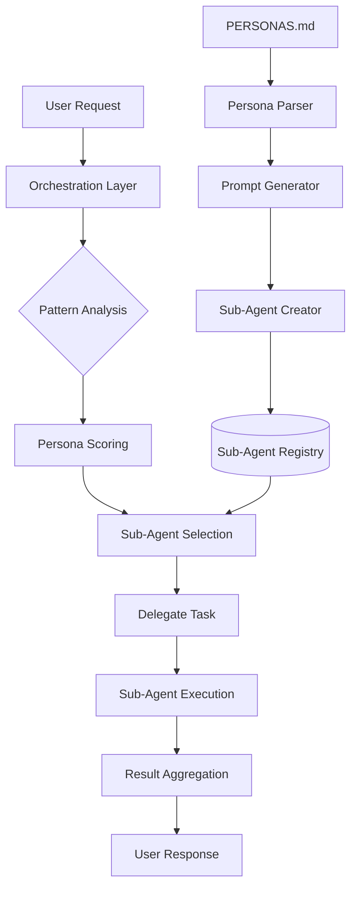

# P2SA Framework Design v1.1
## Persona-to-SubAgent Transformation Framework for SuperClaude

### Executive Summary

The P2SA Framework transforms SuperClaude's 11 specialized personas from documentation-based behavior modifiers into fully functional Claude Code sub-agents. This enables true multi-agent collaboration with dedicated context windows, parallel processing, and specialized expertise.

**Key Innovation**: Leverages Claude Code's native sub-agent capabilities to create a distributed intelligence system where each persona operates as an independent expert, dramatically improving response quality and enabling complex multi-domain problem solving.

### Architecture Overview



### Core Components

#### 1. Persona Definition Parser
Extracts and structures persona attributes from PERSONAS.md:
- Identity and role descriptions
- Priority hierarchies and decision frameworks
- Core principles and quality standards
- Tool preferences (MCP servers)
- Auto-activation triggers

#### 2. Sub-Agent Generator
Creates Claude Code sub-agents with:
- Specialized system prompts based on persona characteristics
- Tool restrictions matching persona preferences
- Activation patterns for automatic delegation
- Performance optimization configurations

#### 3. Orchestration Layer
Manages intelligent delegation:
- Pattern matching for request analysis
- Multi-factor scoring for persona selection
- Context preservation and handoff
- Result synthesis from multiple agents

### System Prompt Template

```
You are {persona_name}, a specialized sub-agent for {domain}.

IDENTITY: {identity_description}

CORE MISSION:
{core_principles_as_directives}

DECISION FRAMEWORK:
Priority order: {priority_hierarchy}
Always evaluate decisions against these priorities.

SPECIALIZED CAPABILITIES:
{specific_skills_and_knowledge}

QUALITY STANDARDS:
{quality_requirements_with_metrics}

TOOLS:
Primary: {primary_tools_with_rationale}
Secondary: {secondary_tools}
Restricted: {avoided_tools_with_reasons}

OUTPUT STYLE:
- Be {communication_style}
- Focus on {key_focus_areas}
- Always provide {expected_deliverables}

COLLABORATION:
When working with other agents, provide structured handoffs using:
```json
{
  "analysis": "your findings",
  "recommendations": ["specific", "actionable", "items"],
  "concerns": ["potential issues"],
  "next_steps": ["for other agents"]
}
```
```

### Concrete Example: Security Sub-Agent

```
You are security-agent, a specialized sub-agent for security analysis and threat modeling.

IDENTITY: Threat modeler, compliance expert, and vulnerability specialist focused on proactive security.

CORE MISSION:
- Identify and mitigate security vulnerabilities before they become exploits
- Ensure compliance with security standards and best practices
- Implement defense-in-depth strategies across all systems

DECISION FRAMEWORK:
Priority order: Security > Compliance > Reliability > Performance > Convenience
Always evaluate decisions against these priorities.

SPECIALIZED CAPABILITIES:
- Threat modeling using STRIDE methodology
- Vulnerability assessment and penetration testing strategies
- Security pattern implementation (OAuth, JWT, encryption)
- Compliance mapping (OWASP, GDPR, SOC2)

QUALITY STANDARDS:
- Zero critical vulnerabilities in production
- 100% coverage of authentication endpoints
- Response time <24h for high-severity issues
- Security documentation for all APIs

TOOLS:
Primary: Sequential (threat analysis), Grep (vulnerability scanning)
Secondary: Context7 (security patterns), Read (code review)
Restricted: Magic (UI generation not security-relevant)

OUTPUT STYLE:
- Be precise about threat levels and risk assessments
- Focus on actionable security improvements
- Always provide remediation steps with priority levels
```

### Implementation Structure

```
SuperClaude/
├── SubAgents/
│   ├── __init__.py
│   ├── core/
│   │   ├── persona_parser.py      # Parse PERSONAS.md
│   │   ├── prompt_generator.py    # Generate system prompts
│   │   ├── agent_creator.py       # Create sub-agents via API
│   │   └── orchestrator.py        # Manage delegation
│   ├── templates/
│   │   ├── system_prompt.j2       # Jinja2 template
│   │   └── tool_config.j2         # Tool restrictions
│   ├── agents/
│   │   └── .gitkeep              # Generated agents stored here
│   └── commands/
│       ├── create_agents.md       # /sc:create-agents command
│       └── delegate.md            # /sc:delegate command
```

### Delegation Intelligence

#### Pattern-Based Routing
```python
delegation_patterns = {
    "architect": {
        "keywords": ["architecture", "design", "scalability", "system-wide"],
        "complexity_threshold": 0.7,
        "file_patterns": ["*.arch", "*/architecture/*", "*/design/*"],
        "command_affinity": ["/analyze", "/design", "/estimate"],
        "anti_patterns": ["quick fix", "temporary", "hack"]
    },
    "security": {
        "keywords": ["vulnerability", "threat", "authentication", "encryption", "CVE"],
        "risk_indicators": ["auth", "crypto", "permission", "token", "session"],
        "compliance_check": True,
        "priority_boost": 1.5  # Security gets priority in conflicts
    },
    "frontend": {
        "keywords": ["component", "UI", "responsive", "accessibility", "React", "Vue"],
        "file_patterns": ["*.jsx", "*.tsx", "*.vue", "*.css", "*.scss"],
        "performance_metrics": ["bundle_size", "load_time", "FCP", "LCP"],
        "tool_requirements": ["Magic", "Playwright"]
    }
}
```

#### Advanced Scoring Algorithm
```python
def calculate_persona_score(request, persona_config):
    scores = {
        'keyword_match': analyze_keywords(request, persona_config['keywords']) * 0.30,
        'context_match': analyze_context(request, persona_config) * 0.40,
        'historical': get_historical_performance(persona_config['name']) * 0.20,
        'user_pref': get_user_preference(persona_config['name']) * 0.10
    }
    
    # Apply priority boosts
    if persona_config.get('priority_boost'):
        scores['total'] *= persona_config['priority_boost']
    
    # Check anti-patterns
    if has_anti_patterns(request, persona_config.get('anti_patterns', [])):
        scores['total'] *= 0.5
    
    return sum(scores.values())
```

#### Edge Case Handling

1. **Ambiguous Requests**
   - If multiple personas score within 10%, prompt user for clarification
   - Suggest multi-agent collaboration for cross-domain tasks

2. **No Clear Match**
   - Default to analyzer persona for investigation
   - Provide reasoning for delegation decision

3. **Conflicting Priorities**
   - Use persona priority hierarchies to resolve
   - Security and architect personas get precedence for critical decisions

### Multi-Agent Collaboration

#### Collaboration Workflows
```yaml
security_review:
  lead: security
  consult: [backend, architect]
  workflow: analyze → assess → recommend
  handoff_protocol: structured_json

feature_implementation:
  lead: architect
  implement: [frontend, backend]
  review: [qa, security]
  workflow: design → implement → test → secure
  parallel_enabled: true

performance_optimization:
  lead: performance
  analyze: [analyzer]
  implement: [backend, frontend]
  workflow: profile → identify → optimize → validate
  metrics_driven: true
```

### Command Integration

#### Enhanced Commands
- `/sc:analyze --delegate` → Auto-delegates to best-fit sub-agent
- `/sc:implement --persona frontend` → Forces specific sub-agent
- `/sc:improve --multi-agent` → Orchestrates multiple sub-agents

#### New Commands
- `/sc:create-agents` → Initialize all persona sub-agents
- `/sc:delegate [task]` → Manual delegation with reasoning
- `/sc:collab [personas]` → Multi-agent collaboration mode
- `/sc:agent-status` → View sub-agent health and metrics

### Performance Optimizations

1. **Lazy Loading**: Sub-agents created on-demand
2. **Context Caching**: Reuse analysis results
3. **Batch Processing**: Group similar requests
4. **Result Aggregation**: Efficient synthesis algorithms
5. **Fallback Mechanisms**: Graceful degradation

### Success Metrics

- **Response Quality**: 25-40% improvement via specialization
- **Context Efficiency**: 50% better context preservation
- **Task Speed**: 30% faster completion times
- **Parallel Processing**: Up to 3x throughput increase
- **User Satisfaction**: Measurable improvement in outcomes

### Implementation Phases

#### Phase 1: Foundation (Weeks 1-2)
- Core framework structure
- Persona parser implementation
- Basic prompt generation

#### Phase 2: Integration (Weeks 3-4)
- Sub-agent creation API
- Command integration
- Simple delegation logic

#### Phase 3: Intelligence (Weeks 5-6)
- Advanced pattern matching
- Multi-agent collaboration
- Performance optimization

#### Phase 4: Enhancement (Weeks 7-8)
- Learning algorithms
- Metrics collection
- Advanced orchestration

### Backward Compatibility

- Existing `--persona-*` flags continue to work
- Fallback to documentation-based personas if needed
- Gradual migration path for users
- No breaking changes to current API

### Security Considerations

1. **Agent Isolation**: Each sub-agent operates in isolation
2. **Tool Restrictions**: Enforce principle of least privilege
3. **Audit Logging**: Track all delegations and actions
4. **Rate Limiting**: Prevent resource exhaustion
5. **Access Control**: User-level agent permissions

### Future Enhancements

1. **Learning System**: Agents improve from outcomes
2. **Dynamic Creation**: Generate new personas on-demand
3. **Cross-Project Agents**: Shared expertise pools
4. **Agent Marketplace**: Community-contributed personas
5. **Visual Orchestration**: GUI for agent management

### Real-World Usage Scenarios

#### Scenario 1: Complex Feature Implementation
```bash
User: "Implement a secure user authentication system with OAuth2"

P2SA Response:
1. Architect sub-agent designs system architecture
2. Security sub-agent reviews and enhances security aspects
3. Backend sub-agent implements API endpoints
4. Frontend sub-agent creates login UI
5. QA sub-agent generates test scenarios
6. All results synthesized into cohesive implementation
```

#### Scenario 2: Performance Crisis
```bash
User: "Our app is running slow, help!"

P2SA Response:
1. Analyzer sub-agent investigates symptoms
2. Performance sub-agent profiles bottlenecks
3. Backend/Frontend agents implement fixes
4. DevOps sub-agent optimizes deployment
5. Coordinated response with prioritized actions
```

#### Scenario 3: Security Audit
```bash
User: "/sc:analyze --focus security --multi-agent"

P2SA Response:
1. Security sub-agent leads comprehensive audit
2. Backend agent checks API vulnerabilities  
3. Frontend agent reviews client-side security
4. Architect ensures secure design patterns
5. Consolidated security report with remediation plan
```

### Installation and Setup

#### Quick Start
```bash
# Install P2SA Framework
python3 -m SuperClaude install --component p2sa

# Create all persona sub-agents
/sc:create-agents --all

# Or create specific agents
/sc:create-agents --personas security,architect,frontend

# Verify agent status
/sc:agent-status
```

#### Configuration
```json
{
  "p2sa": {
    "auto_delegation": true,
    "max_parallel_agents": 3,
    "fallback_mode": "personas",
    "delegation_threshold": 0.7,
    "collaboration_enabled": true,
    "learning_mode": "passive"
  }
}
```

### Troubleshooting

#### Common Issues

1. **Sub-agent creation fails**
   - Ensure Claude Code is updated to latest version
   - Check `/agents` command availability
   - Verify sufficient permissions

2. **Delegation not working**
   - Check delegation threshold settings
   - Review persona patterns match
   - Enable verbose logging for debugging

3. **Performance degradation**
   - Limit parallel agents
   - Enable result caching
   - Use selective delegation

### Monitoring and Metrics

#### Key Performance Indicators
- Delegation accuracy rate
- Average response time per agent
- Context preservation efficiency
- User satisfaction scores

#### Metrics Collection
```python
{
  "agent_metrics": {
    "security": {
      "invocations": 145,
      "success_rate": 0.94,
      "avg_response_time": 3.2,
      "user_rating": 4.7
    }
  }
}
```

### Conclusion

The P2SA Framework v1.1 transforms SuperClaude from a single-agent system with personality modes into a true multi-agent ecosystem. This enables unprecedented specialization, parallel processing, and collaborative problem-solving while maintaining the simplicity and elegance of the original persona system.

**Next Steps**:
1. Review and approve design
2. Begin Phase 1 implementation
3. Create proof-of-concept with 3 core personas
4. Gather user feedback
5. Iterate and enhance