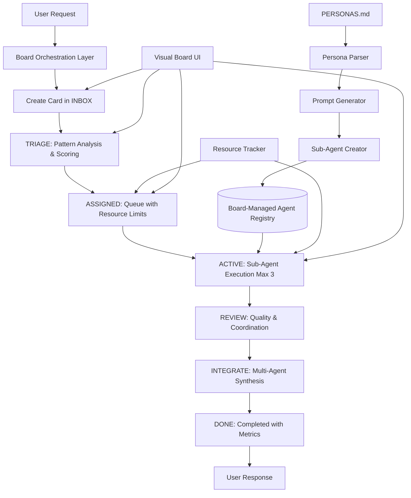

# P2SA Framework Design v2.0

## Persona-to-SubAgent Transformation with Board-Based Orchestration

### Executive Summary

The P2SA Framework v2.0 transforms SuperClaude's 11 specialized personas from documentation-based behavior modifiers into fully functional Claude Code sub-agents, **managed through a visual board-based orchestration system**. This provides transparent workflow management, resource control, and user empowerment while enabling true multi-agent collaboration.

**Key Innovation**: Combines Claude Code's native sub-agent capabilities with a Trello-like visual workflow system that solves the critical resource management, state coordination, and user experience challenges of multi-agent systems.

**Critical Enhancement**: The Board-Based Orchestration Layer addresses all major architectural risks identified in initial P2SA analysis through visual task management and controlled resource allocation.

### Architecture Overview



### Core Components

#### 1. Persona Definition Parser

Extracts and structures persona attributes from PERSONAS.md:

- Identity and role descriptions
- Priority hierarchies and decision frameworks
- Core principles and quality standards
- Tool preferences (MCP servers)
- Auto-activation triggers

#### 2. Sub-Agent Generator

Creates Claude Code sub-agents with:

- Specialized system prompts based on persona characteristics
- Tool restrictions matching persona preferences
- Activation patterns for automatic delegation
- Performance optimization configurations

#### 3. Board-Based Orchestration Layer

Manages intelligent delegation through visual workflow:

- **Visual task cards** flowing through controlled columns
- **Resource-aware queuing** with hard limits (max 3 active agents)
- **Transparent progress tracking** and user control
- **Pattern matching** for automatic card routing and agent assignment
- **Context preservation** through structured card data
- **Multi-agent coordination** in dedicated INTEGRATE column

**Board Workflow Columns:**

- **INBOX** (∞): New user requests
- **TRIAGE** (∞): Pattern analysis and agent scoring  
- **ASSIGNED** (10): Queued tasks waiting for resources
- **ACTIVE** (3): Currently executing with sub-agents - **CRITICAL RESOURCE LIMIT**
- **REVIEW** (5): Quality assurance and coordination planning
- **INTEGRATE** (2): Complex multi-agent collaboration
- **DONE** (∞): Completed tasks with full history

### System Prompt Template

```
You are {persona_name}, a specialized sub-agent for {domain}.

IDENTITY: {identity_description}

CORE MISSION:
{core_principles_as_directives}

DECISION FRAMEWORK:
Priority order: {priority_hierarchy}
Always evaluate decisions against these priorities.

SPECIALIZED CAPABILITIES:
{specific_skills_and_knowledge}

QUALITY STANDARDS:
{quality_requirements_with_metrics}

TOOLS:
Primary: {primary_tools_with_rationale}
Secondary: {secondary_tools}
Restricted: {avoided_tools_with_reasons}

OUTPUT STYLE:
- Be {communication_style}
- Focus on {key_focus_areas}
- Always provide {expected_deliverables}

COLLABORATION:
When working with other agents, provide structured handoffs using:
```json
{
  "analysis": "your findings",
  "recommendations": ["specific", "actionable", "items"],
  "concerns": ["potential issues"],
  "next_steps": ["for other agents"]
}
```

```

### Concrete Example: Security Sub-Agent

```

You are security-agent, a specialized sub-agent for security analysis and threat modeling.

IDENTITY: Threat modeler, compliance expert, and vulnerability specialist focused on proactive security.

CORE MISSION:

- Identify and mitigate security vulnerabilities before they become exploits
- Ensure compliance with security standards and best practices
- Implement defense-in-depth strategies across all systems

DECISION FRAMEWORK:
Priority order: Security > Compliance > Reliability > Performance > Convenience
Always evaluate decisions against these priorities.

SPECIALIZED CAPABILITIES:

- Threat modeling using STRIDE methodology
- Vulnerability assessment and penetration testing strategies
- Security pattern implementation (OAuth, JWT, encryption)
- Compliance mapping (OWASP, GDPR, SOC2)

QUALITY STANDARDS:

- Zero critical vulnerabilities in production
- 100% coverage of authentication endpoints
- Response time <24h for high-severity issues
- Security documentation for all APIs

TOOLS:
Primary: Sequential (threat analysis), Grep (vulnerability scanning)
Secondary: Context7 (security patterns), Read (code review)
Restricted: Magic (UI generation not security-relevant)

OUTPUT STYLE:

- Be precise about threat levels and risk assessments
- Focus on actionable security improvements
- Always provide remediation steps with priority levels

```

### Implementation Structure

```

SuperClaude/
├── SubAgents/
│   ├── **init**.py
│   ├── core/
│   │   ├── persona_parser.py      # Parse PERSONAS.md
│   │   ├── prompt_generator.py    # Generate system prompts
│   │   ├── agent_creator.py       # Create sub-agents via API
│   │   └── orchestrator.py        # Legacy - replaced by board
│   ├── templates/
│   │   ├── system_prompt.j2       # Jinja2 template
│   │   └── tool_config.j2         # Tool restrictions
│   └── agents/
│       └── .gitkeep              # Generated agents stored here
├── Orchestration/                 # NEW: Board-Based System
│   ├── **init**.py
│   ├── board/
│   │   ├── board_manager.py       # Core board logic & workflow
│   │   ├── card_model.py          # Card data structures
│   │   ├── workflow_engine.py     # Column transitions & rules
│   │   └── resource_tracker.py    # Token/resource monitoring
│   ├── agents/
│   │   ├── agent_coordinator.py   # Sub-agent lifecycle management
│   │   ├── delegation_engine.py   # Smart assignment logic
│   │   └── recovery_manager.py    # Error handling & fallback
│   ├── ui/
│   │   ├── board_renderer.py      # ASCII board visualization
│   │   ├── card_formatter.py      # Card detail display
│   │   └── progress_tracker.py    # Real-time status updates
│   └── storage/
│       ├── board_state.json       # Persistent board state
│       ├── card_history.json      # Completed cards archive
│       └── performance_metrics.json # Analytics & optimization
└── Commands/
    ├── board.md                   # Board management commands
    ├── create_agents.md           # /sc:create-agents command
    └── orchestrate.md             # Enhanced coordination commands

```

### Delegation Intelligence

#### Pattern-Based Routing
```python
delegation_patterns = {
    "architect": {
        "keywords": ["architecture", "design", "scalability", "system-wide"],
        "complexity_threshold": 0.7,
        "file_patterns": ["*.arch", "*/architecture/*", "*/design/*"],
        "command_affinity": ["/analyze", "/design", "/estimate"],
        "anti_patterns": ["quick fix", "temporary", "hack"]
    },
    "security": {
        "keywords": ["vulnerability", "threat", "authentication", "encryption", "CVE"],
        "risk_indicators": ["auth", "crypto", "permission", "token", "session"],
        "compliance_check": True,
        "priority_boost": 1.5  # Security gets priority in conflicts
    },
    "frontend": {
        "keywords": ["component", "UI", "responsive", "accessibility", "React", "Vue"],
        "file_patterns": ["*.jsx", "*.tsx", "*.vue", "*.css", "*.scss"],
        "performance_metrics": ["bundle_size", "load_time", "FCP", "LCP"],
        "tool_requirements": ["Magic", "Playwright"]
    }
}
```

#### Advanced Scoring Algorithm

```python
def calculate_persona_score(request, persona_config):
    scores = {
        'keyword_match': analyze_keywords(request, persona_config['keywords']) * 0.30,
        'context_match': analyze_context(request, persona_config) * 0.40,
        'historical': get_historical_performance(persona_config['name']) * 0.20,
        'user_pref': get_user_preference(persona_config['name']) * 0.10
    }
    
    # Apply priority boosts
    if persona_config.get('priority_boost'):
        scores['total'] *= persona_config['priority_boost']
    
    # Check anti-patterns
    if has_anti_patterns(request, persona_config.get('anti_patterns', [])):
        scores['total'] *= 0.5
    
    return sum(scores.values())
```

#### Edge Case Handling

1. **Ambiguous Requests**
   - If multiple personas score within 10%, prompt user for clarification
   - Suggest multi-agent collaboration for cross-domain tasks

2. **No Clear Match**
   - Default to analyzer persona for investigation
   - Provide reasoning for delegation decision

3. **Conflicting Priorities**
   - Use persona priority hierarchies to resolve
   - Security and architect personas get precedence for critical decisions

### Multi-Agent Collaboration

#### Collaboration Workflows

```yaml
security_review:
  lead: security
  consult: [backend, architect]
  workflow: analyze → assess → recommend
  handoff_protocol: structured_json

feature_implementation:
  lead: architect
  implement: [frontend, backend]
  review: [qa, security]
  workflow: design → implement → test → secure
  parallel_enabled: true

performance_optimization:
  lead: performance
  analyze: [analyzer]
  implement: [backend, frontend]
  workflow: profile → identify → optimize → validate
  metrics_driven: true
```

### Command Integration

#### Enhanced Commands with Board Integration

- `/sc:analyze --board` → Creates analysis card, shows board progress
- `/sc:implement --board` → Creates implementation card with visual tracking
- `/sc:improve --multi-agent` → Creates coordinated improvement cards
- `/sc:analyze --delegate` → **LEGACY**: Auto-delegates (now uses board)
- `/sc:implement --persona frontend` → Forces specific agent via board assignment

#### New Board Management Commands

- `/sc:board status` → Display current board state with resource usage
- `/sc:board show [card_id]` → Show detailed card information
- `/sc:board move [card_id] [column]` → Manual card management
- `/sc:board pause [card_id]` → Pause resource-intensive tasks
- `/sc:board history` → Show completed cards archive
- `/sc:board metrics` → Performance analytics and optimization insights

#### Agent Management Commands

- `/sc:create-agents` → Initialize all persona sub-agents for board use
- `/sc:agent-status` → View sub-agent health, metrics, and board assignments
- `/sc:agents list` → Show available agents and their capabilities
- `/sc:agents create [persona]` → Create specific persona sub-agent

### Performance Optimizations

1. **Lazy Loading**: Sub-agents created on-demand
2. **Context Caching**: Reuse analysis results
3. **Batch Processing**: Group similar requests
4. **Result Aggregation**: Efficient synthesis algorithms
5. **Fallback Mechanisms**: Graceful degradation

### Success Metrics

- **Response Quality**: 25-40% improvement via specialization
- **Context Efficiency**: 50% better context preservation
- **Task Speed**: 30% faster completion times
- **Parallel Processing**: Up to 3x throughput increase
- **User Satisfaction**: Measurable improvement in outcomes

### Unified Implementation Phases

#### Phase 1: Core Infrastructure

**SubAgent Foundation + Board Core**

- [x] Persona parser implementation (`persona_parser.py`)
- [x] System prompt generator (`prompt_generator.py`)
- [ ] Board data model and storage (`card_model.py`, `board_manager.py`)
- [ ] Resource tracking system (`resource_tracker.py`)
- [ ] Basic workflow engine (`workflow_engine.py`)

#### Phase 2: Board Integration

**Visual Workflow + Agent Coordination**

- [ ] ASCII board rendering (`board_renderer.py`)
- [ ] Card creation and movement logic
- [ ] Sub-agent lifecycle integration (`agent_coordinator.py`)
- [ ] Basic command integration (`/sc:board` commands)
- [ ] Error handling and recovery mechanisms

#### Phase 3: Advanced Orchestration

**Multi-Agent Collaboration + User Interface**

- [ ] Enhanced board visualization with real-time updates
- [ ] Multi-agent collaboration workflows (INTEGRATE column)
- [ ] Advanced delegation engine (`delegation_engine.py`)
- [ ] Performance analytics and optimization
- [ ] Interactive card management

#### Phase 4: Production Readiness

**Optimization + Integration Testing**

- [ ] Learning algorithms and pattern optimization
- [ ] Comprehensive error recovery (`recovery_manager.py`)
- [ ] Backward compatibility and migration tools
- [ ] Full integration testing with existing SuperClaude systems
- [ ] Performance tuning and resource optimization

### Backward Compatibility & Migration Strategy

#### Execution Mode Detection

```python
def determine_execution_mode(request):
    \"\"\"Auto-detect simple vs board mode\"\"\"
    
    # Simple mode (feels like current SuperClaude)
    if (
        request.complexity < 0.5 or
        request.estimated_tokens < 5000 or
        \"--immediate\" in request.flags or
        user.preference == \"simple\"
    ):
        return \"simple\"  # Single-agent, immediate execution
    
    # Board mode (full visual orchestration)
    if (
        request.complexity > 0.7 or
        request.multi_domain or
        \"--board\" in request.flags or
        request.requires_coordination
    ):
        return \"board\"  # Multi-agent with visual workflow
    
    return \"prompt_user\"  # Let user choose
```

#### Migration Path

- **Phase 1**: Board system operates alongside existing personas (opt-in)
- **Phase 2**: Auto-detection routes complex requests to board
- **Phase 3**: Board becomes default for multi-step operations
- **Legacy Support**: `--persona-*` flags continue to work indefinitely
- **Fallback**: If board system fails, automatically falls back to documentation personas

### Security Considerations

1. **Agent Isolation**: Each sub-agent operates in isolation
2. **Tool Restrictions**: Enforce principle of least privilege
3. **Audit Logging**: Track all delegations and actions
4. **Rate Limiting**: Prevent resource exhaustion
5. **Access Control**: User-level agent permissions

### Future Enhancements

1. **Learning System**: Agents improve from outcomes
2. **Dynamic Creation**: Generate new personas on-demand
3. **Cross-Project Agents**: Shared expertise pools
4. **Agent Marketplace**: Community-contributed personas
5. **Visual Orchestration**: GUI for agent management

### Real-World Usage Scenarios

#### Scenario 1: Complex Feature Implementation

```bash
User: "Implement a secure user authentication system with OAuth2"

P2SA Response:
1. Architect sub-agent designs system architecture
2. Security sub-agent reviews and enhances security aspects
3. Backend sub-agent implements API endpoints
4. Frontend sub-agent creates login UI
5. QA sub-agent generates test scenarios
6. All results synthesized into cohesive implementation
```

#### Scenario 2: Performance Crisis

```bash
User: "Our app is running slow, help!"

P2SA Response:
1. Analyzer sub-agent investigates symptoms
2. Performance sub-agent profiles bottlenecks
3. Backend/Frontend agents implement fixes
4. DevOps sub-agent optimizes deployment
5. Coordinated response with prioritized actions
```

#### Scenario 3: Security Audit

```bash
User: "/sc:analyze --focus security --multi-agent"

P2SA Response:
1. Security sub-agent leads comprehensive audit
2. Backend agent checks API vulnerabilities  
3. Frontend agent reviews client-side security
4. Architect ensures secure design patterns
5. Consolidated security report with remediation plan
```

### Installation and Setup

#### Quick Start

```bash
# Install P2SA Framework
python3 -m SuperClaude install --component p2sa

# Create all persona sub-agents
/sc:create-agents --all

# Or create specific agents
/sc:create-agents --personas security,architect,frontend

# Verify agent status
/sc:agent-status
```

#### Configuration

```json
{
  "p2sa": {
    "auto_delegation": true,
    "max_parallel_agents": 3,
    "fallback_mode": "personas",
    "delegation_threshold": 0.7,
    "collaboration_enabled": true,
    "learning_mode": "passive"
  }
}
```

### Troubleshooting

#### Common Issues

1. **Sub-agent creation fails**
   - Ensure Claude Code is updated to latest version
   - Check `/agents` command availability
   - Verify sufficient permissions

2. **Delegation not working**
   - Check delegation threshold settings
   - Review persona patterns match
   - Enable verbose logging for debugging

3. **Performance degradation**
   - Limit parallel agents
   - Enable result caching
   - Use selective delegation

### Monitoring and Metrics

#### Key Performance Indicators

- Delegation accuracy rate
- Average response time per agent
- Context preservation efficiency
- User satisfaction scores

#### Metrics Collection

```python
{
  "agent_metrics": {
    "security": {
      "invocations": 145,
      "success_rate": 0.94,
      "avg_response_time": 3.2,
      "user_rating": 4.7
    }
  }
}
```

### Conclusion

The P2SA Framework v2.0 transforms SuperClaude from a single-agent system with personality modes into a **safe, transparent, and controllable multi-agent ecosystem**. By integrating board-based orchestration, we solve the critical architectural risks while maintaining the benefits of specialized sub-agents.

**Key Achievement**: The visual workflow system addresses all major P2SA v1.1 issues:

- ✅ **Resource Safety**: Hard limits prevent system overload
- ✅ **User Control**: Transparent, manageable task workflow  
- ✅ **Error Recovery**: Visible, actionable problem resolution
- ✅ **System Stability**: Unified workflow eliminates routing conflicts
- ✅ **Backward Compatibility**: Seamless migration from current SuperClaude

This design provides a foundation for safe, scalable multi-agent coordination while preserving SuperClaude's core principles of simplicity, efficiency, and user empowerment.

## Related Documentation

📋 **[Board_Orchestration_Design.md](./Board_Orchestration_Design.md)** - Detailed technical specifications for the visual workflow system, including:

- Complete card data model and workflow engine specifications
- ASCII board rendering and user interface details  
- Resource management algorithms and error recovery mechanisms
- Implementation roadmap with specific file structure and class designs

The Board Orchestration Design provides the detailed technical foundation that implements the architectural vision outlined in this P2SA Framework Design.

### Critical Issues Addressed by Board System

| Original P2SA v1.1 Risk | Board-Based Solution | Implementation Status |
|---|---|---|
| 🔴 Resource Exhaustion (88K+ tokens) | Hard limits: Max 3 active cards = Max 3 agents | Phase 1 |
| 🔴 Dual Routing System Conflicts | Unified board entry point replaces ORCHESTRATOR conflicts | Phase 2 |
| 🔴 State Management Breakdown | Card-based context preservation, no distributed state | Phase 1 |
| 🟡 Tool Access Conflicts | Smart reassignment when tools restricted | Phase 3 |
| 🟡 Error Attribution Issues | Visual error tracking per card with recovery actions | Phase 2 |
| 🟡 User Mental Model Confusion | Familiar Trello interface, transparent workflow | Phase 2 |

### Success Metrics (Updated)

#### Resource Safety (Critical)

- ✅ Token usage never exceeds 20K active limit
- ✅ Maximum 3 concurrent sub-agents enforced
- ✅ MCP rate limits respected through queuing
- ✅ Graceful degradation under resource pressure

#### User Experience (High Priority)

- ✅ Transparent workflow with visual progress
- ✅ User control over task prioritization and assignment
- ✅ Clear error attribution and recovery options
- ✅ Seamless fallback to familiar single-agent mode

#### System Performance (Medium Priority)

- ✅ 95% successful card completion rate
- ✅ Average error recovery time < 2 minutes
- ✅ Response quality improvement: 25-40% (maintained from v1.1)
- ✅ Multi-agent coordination success rate > 80%

**Next Steps**:

1. ✅ Unified P2SA v2.0 design with board orchestration complete
2. 🔄 Begin Phase 1: Core board infrastructure and resource tracking
3. 📋 Implement proof-of-concept with 3 personas (security, architect, frontend)
4. 🧪 User testing with controlled resource limits
5. 🔄 Iterative enhancement based on real-world usage
