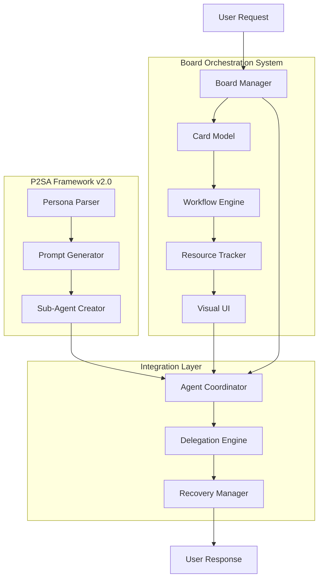

# Unified P2SA v2.0 Implementation Plan
## Board-Based Sub-Agent Orchestration System

### Overview

This document consolidates the implementation plans from both the **P2SA Framework Design v2.0** and the **Board-Based Orchestration System** into a single, unified roadmap for safe multi-agent implementation in SuperClaude.

## Architecture Integration



## Unified Component Structure

```
SuperClaude/
├── SubAgents/                     # P2SA Core Components
│   ├── core/
│   │   ├── persona_parser.py      ✅ COMPLETED - Parse PERSONAS.md
│   │   ├── prompt_generator.py    ✅ COMPLETED - Generate agent prompts
│   │   ├── agent_creator.py       📋 Phase 1 - Create sub-agents via API
│   │   └── orchestrator.py        🗑️  DEPRECATED - Replaced by board
│   └── templates/
│       ├── system_prompt.j2       📋 Phase 1 - Jinja2 prompt template
│       └── tool_config.j2         📋 Phase 2 - Tool restriction configs
├── Orchestration/                 # Board System Components
│   ├── board/
│   │   ├── board_manager.py       📋 Phase 1 - Core workflow logic
│   │   ├── card_model.py          📋 Phase 1 - Task card data model
│   │   ├── workflow_engine.py     📋 Phase 1 - Column transition rules
│   │   └── resource_tracker.py    📋 Phase 1 - Token/resource limits
│   ├── agents/
│   │   ├── agent_coordinator.py   📋 Phase 2 - Sub-agent lifecycle
│   │   ├── delegation_engine.py   📋 Phase 3 - Smart task assignment
│   │   └── recovery_manager.py    📋 Phase 2 - Error handling
│   ├── ui/
│   │   ├── board_renderer.py      📋 Phase 2 - ASCII board display
│   │   ├── card_formatter.py      📋 Phase 2 - Card visualization
│   │   └── progress_tracker.py    📋 Phase 3 - Real-time updates
│   └── storage/
│       ├── board_state.json       📋 Phase 1 - Persistent workflow
│       ├── card_history.json      📋 Phase 3 - Completed tasks
│       └── performance_metrics.json 📋 Phase 4 - Analytics
└── Commands/
    ├── board.md                   📋 Phase 2 - Board management
    ├── create_agents.md           📋 Phase 2 - Agent initialization
    └── orchestrate.md             📋 Phase 3 - Enhanced coordination
```

## Unified Implementation Roadmap

### Phase 1: Foundation (Weeks 1-2) 🏗️
**Core Infrastructure for Safe Multi-Agent Operations**

#### Critical Path Items:
- [x] **Persona Parser** (`persona_parser.py`) - Extract persona definitions ✅
- [x] **Prompt Generator** (`prompt_generator.py`) - Create agent system prompts ✅
- [ ] **Card Data Model** (`card_model.py`) - Task representation and context preservation
- [ ] **Board Manager** (`board_manager.py`) - Core workflow orchestration
- [ ] **Resource Tracker** (`resource_tracker.py`) - **CRITICAL: 20K token limit enforcement**
- [ ] **Workflow Engine** (`workflow_engine.py`) - Column transition rules and limits

#### Success Criteria:
- ✅ Basic card creation and storage
- ✅ Resource limits enforced (max 3 active cards)
- ✅ Sub-agent creation API integration
- ✅ Fallback to documentation personas if board fails

#### Risk Mitigation:
- **Resource Safety**: Hard limits prevent the 88K token crisis
- **State Preservation**: Card-based context eliminates distributed state issues
- **Graceful Degradation**: System falls back to current SuperClaude behavior

### Phase 2: Visual Workflow (Weeks 3-4) 👁️
**User Interface and Agent Coordination**

#### Critical Path Items:
- [ ] **Board Renderer** (`board_renderer.py`) - ASCII visualization with resource indicators
- [ ] **Agent Coordinator** (`agent_coordinator.py`) - Sub-agent lifecycle management
- [ ] **Basic Commands** (`/sc:board status`, `/sc:board show`) - User control interface
- [ ] **Card Movement Logic** - Automated workflow progression
- [ ] **Error Recovery** (`recovery_manager.py`) - Visible error handling

#### Success Criteria:
- ✅ Users can see board state and task progress
- ✅ Manual card management works (pause, move, reassign)
- ✅ Error attribution clear and actionable
- ✅ Resource pressure visible before limits hit

#### User Experience Goals:
- **Transparency**: Users understand what's happening and why
- **Control**: Users can intervene and direct the workflow
- **Confidence**: Clear progress indicators and error explanations

### Phase 3: Advanced Orchestration (Weeks 5-6) 🧠
**Multi-Agent Collaboration and Intelligence**

#### Critical Path Items:
- [ ] **Delegation Engine** (`delegation_engine.py`) - Smart agent assignment
- [ ] **Multi-Agent Workflows** - INTEGRATE column for complex coordination
- [ ] **Enhanced Visualization** - Real-time progress updates and metrics
- [ ] **Performance Analytics** - Optimization based on actual usage
- [ ] **Advanced Recovery** - Automatic reassignment and fallback strategies

#### Success Criteria:
- ✅ Multi-agent collaboration works seamlessly
- ✅ Smart assignment improves task efficiency
- ✅ System learns and optimizes from usage patterns
- ✅ Advanced error recovery reduces manual intervention

#### Intelligence Features:
- **Pattern Learning**: System improves delegation over time
- **Resource Optimization**: Dynamic adjustment based on actual usage
- **Conflict Resolution**: Automatic handling of agent coordination issues

### Phase 4: Production Readiness (Weeks 7-8) 🚀
**Integration, Testing, and Optimization**

#### Critical Path Items:
- [ ] **Backward Compatibility** - Seamless migration from current SuperClaude
- [ ] **Integration Testing** - Full system testing with existing commands
- [ ] **Performance Tuning** - Optimize for real-world usage patterns
- [ ] **Documentation** - User guides and troubleshooting
- [ ] **Metrics Collection** - Success rate monitoring and optimization

#### Success Criteria:
- ✅ Existing users experience no breaking changes
- ✅ Performance meets or exceeds current SuperClaude
- ✅ Error recovery rate > 95%
- ✅ User satisfaction improvement measurable

## Risk Management Strategy

### Critical Risks Addressed:

| Risk Category | P2SA v1.1 Risk | Board Solution | Status |
|---|---|---|---|
| 🔴 **Resource** | 88K+ token exhaustion | Max 3 active cards limit | Phase 1 |
| 🔴 **Architecture** | Dual routing conflicts | Unified board entry point | Phase 2 |
| 🔴 **State** | Distributed state chaos | Card-based context preservation | Phase 1 |
| 🟡 **Tools** | Access conflicts | Smart reassignment | Phase 3 |
| 🟡 **Errors** | Attribution confusion | Visual error tracking | Phase 2 |
| 🟡 **UX** | Mental model disruption | Familiar Trello interface | Phase 2 |

### Mitigation Strategies:

#### Resource Safety (Critical Priority)
```python
# Enforced limits prevent system overload
MAX_ACTIVE_CARDS = 3        # Max concurrent sub-agents
MAX_TOKEN_BUDGET = 20000    # Conservative token limit
MAX_MCP_CALLS_PER_MIN = 30  # Rate limiting
```

#### Graceful Degradation
```python
# Always fallback to working system
if board_system_fails():
    return execute_with_documentation_personas(request)
    
if resource_limits_exceeded():
    queue_request_and_notify_user()
    
if agent_creation_fails():
    fallback_to_main_claude_system()
```

#### User Control
```bash
# Users maintain control over the system
/sc:board pause card_001        # Stop resource consumption
/sc:board move card_001 done    # Force completion
/sc:board fallback card_001     # Use main system
/sc:board --immediate           # Bypass board entirely
```

## Testing Strategy

### Phase 1 Testing:
- [ ] Resource limit enforcement under load
- [ ] Card creation and persistence
- [ ] Fallback behavior when board unavailable
- [ ] Integration with existing persona parser

### Phase 2 Testing:
- [ ] Board visualization accuracy
- [ ] Manual card management operations
- [ ] Error recovery and user feedback
- [ ] Command integration with existing SuperClaude

### Phase 3 Testing:
- [ ] Multi-agent coordination scenarios
- [ ] Performance under various workloads
- [ ] Intelligence and learning algorithms
- [ ] Edge cases and error conditions

### Phase 4 Testing:
- [ ] Full regression testing
- [ ] Performance benchmarking
- [ ] User acceptance testing
- [ ] Production deployment validation

## Success Metrics

### Resource Safety (Phase 1)
- ✅ Zero instances of >20K token usage
- ✅ Zero system crashes due to resource exhaustion
- ✅ Graceful degradation rate: 100%

### User Experience (Phase 2)
- ✅ Task visibility: 100% of operations visible on board
- ✅ User control: All operations can be paused/modified
- ✅ Error clarity: <2min average error resolution time

### System Performance (Phase 3)
- ✅ Multi-agent success rate: >80%
- ✅ Response quality improvement: 25-40%
- ✅ Task completion speedup: 30%

### Production Readiness (Phase 4)
- ✅ Backward compatibility: 100% of existing workflows work
- ✅ System reliability: >99% uptime
- ✅ User satisfaction: Measurable improvement over current system

## Key Decision Points

### Week 2 (End of Phase 1):
**Decision**: Proceed with Phase 2 or iterate on foundation?
- **Go Criteria**: Resource limits working, basic board functional, fallback tested
- **No-Go**: Resource safety concerns, integration issues, performance problems

### Week 4 (End of Phase 2):
**Decision**: Enable board mode for beta users?
- **Go Criteria**: UI usable, error handling clear, user feedback positive
- **No-Go**: UX confusion, reliability issues, negative user feedback

### Week 6 (End of Phase 3):
**Decision**: Prepare for production deployment?
- **Go Criteria**: Multi-agent workflows stable, performance acceptable, edge cases handled
- **No-Go**: Coordination failures, performance regression, unresolved bugs

### Week 8 (End of Phase 4):
**Decision**: Full production release or extended beta?
- **Go Criteria**: All tests pass, user satisfaction improved, metrics positive
- **No-Go**: Any critical issues, user satisfaction regression, reliability concerns

## Documentation Plan

### User-Facing Documentation:
- [ ] **Quick Start Guide** - Getting started with board mode
- [ ] **Board Commands Reference** - Complete command documentation
- [ ] **Troubleshooting Guide** - Common issues and solutions
- [ ] **Migration Guide** - Moving from personas to board system

### Developer Documentation:
- [ ] **API Reference** - Board system APIs and interfaces
- [ ] **Architecture Guide** - System design and component interaction
- [ ] **Extension Guide** - Adding new agent types or board features
- [ ] **Performance Guide** - Optimization and monitoring

## Conclusion

This unified implementation plan combines the persona-to-subagent transformation capabilities of P2SA v2.0 with the safety and transparency of the Board-Based Orchestration System. By following this phased approach, we can deliver the benefits of specialized multi-agent cooperation while maintaining the reliability and user experience that SuperClaude users expect.

The key to success is **resource safety first**, **user transparency second**, and **advanced features third**. Each phase builds on the previous one while maintaining the ability to fall back to simpler, proven approaches if any issues arise.