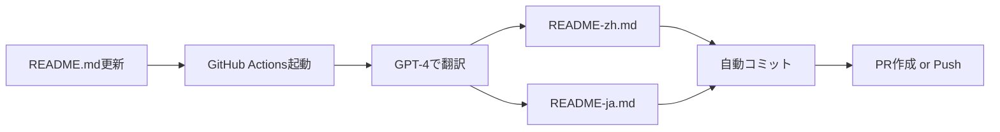

# README Auto-Translation Workflow

## 概要

SuperClaudeは **GPT-Translate** を使用して、READMEの自動翻訳を実現しています。

## 🎯 仕組み



## 🔧 セットアップ

### 1. OpenAI APIキーの設定

GitHub リポジトリの Settings → Secrets → Actions で以下を追加:

```
Name: OPENAI_API_KEY
Value: sk-proj-xxxxxxxxxxxxx
```

### 2. ワークフローの動作

**自動起動トリガー:**
- `README.md` が更新されたとき (master/mainブランチ)
- Pull Requestで `README.md` が変更されたとき
- 手動実行 (workflow_dispatch)

**動作:**
1. README.md を GPT-4 で翻訳
2. README-zh.md (簡体字中国語) を生成
3. README-ja.md (日本語) を生成
4. 変更があれば自動コミット
5. masterブランチなら直接Push、PRなら新規PR作成

## 📊 コスト見積もり

| ファイルサイズ | GPT-4 Token数 | 推定コスト |
|:-------------:|:-------------:|:----------:|
| 5KB README    | ~3,000 tokens | ~$0.03     |
| 10KB README   | ~6,000 tokens | ~$0.06     |
| 20KB README   | ~12,000 tokens| ~$0.12    |

**月間コスト見積もり:**
- README更新頻度: 月10回
- 1回あたり: $0.06 (2言語翻訳)
- **月額: 約$0.60 (¥90)**

## 🛡️ セキュリティ

**APIキー保護:**
- GitHub Secrets で暗号化保存
- ワークフローログには表示されない
- Pull Requestからはforkでアクセス不可

**権限管理:**
```yaml
permissions:
  contents: write      # 翻訳ファイルのコミット用
  pull-requests: write # PR作成用
```

## 🔄 使用方法

### 自動翻訳 (推奨)

README.mdを更新してコミット・プッシュするだけ:

```bash
# README.md を編集
vim README.md

# コミット
git add README.md
git commit -m "docs: update README"
git push origin main

# → GitHub Actionsが自動的に翻訳を実行
```

### 手動実行

GitHub UI から:
1. Actions タブを開く
2. "Auto-translate README" を選択
3. "Run workflow" をクリック

### ローカルテスト

翻訳品質を事前確認する場合:

```bash
# GPT-Translateをローカルで実行
npm install -g gpt-translate
export OPENAI_API_KEY="sk-proj-xxxxx"

gpt-translate --input README.md --output README-zh.md --lang "Simplified Chinese"
gpt-translate --input README.md --output README-ja.md --lang "Japanese"
```

## 📝 翻訳品質チェック

**自動翻訳後の確認ポイント:**

1. **技術用語の正確性**
   - フレームワーク名、コマンド名が正しいか
   - コードブロックが保持されているか

2. **マークダウン構造**
   - 見出しレベルが一致しているか
   - リンクが正しく変換されているか

3. **ニュアンス**
   - 文脈に合った翻訳か
   - 自然な表現か

**修正が必要な場合:**
- 自動翻訳後に手動で微調整
- 次回の翻訳時にその修正が維持されるよう考慮

## 🚫 トラブルシューティング

### エラー: "OPENAI_API_KEY not found"

**原因:** GitHub Secretsが設定されていない

**解決策:**
```bash
# リポジトリ設定を確認
Settings → Secrets and variables → Actions → New repository secret
```

### エラー: "Translation failed"

**原因:** OpenAI API レート制限

**解決策:**
- 数分待ってから再実行
- API使用量を確認: https://platform.openai.com/usage

### 翻訳品質が低い

**原因:** プロンプトが最適化されていない

**改善策:**
```yaml
# .github/workflows/translation-sync.yml
with:
  apikey: ${{ secrets.OPENAI_API_KEY }}
  inputFiles: 'README.md'
  outputFiles: 'README-zh.md'
  targetLanguage: 'Simplified Chinese'
  prompt: 'Translate this technical documentation accurately, preserving all code blocks and technical terms.'
```

## 🔗 関連リンク

- [GPT-Translate GitHub](https://github.com/3ru/gpt-translate)
- [OpenAI API Documentation](https://platform.openai.com/docs)
- [GitHub Actions Documentation](https://docs.github.com/actions)

## 📊 翻訳統計

現在の翻訳実績は GitHub Actions の Workflows タブから確認できます:

```
Repository → Actions → Auto-translate README → 実行履歴
```

**確認できる情報:**
- 翻訳実行回数
- 成功/失敗率
- 実行時間
- 翻訳されたファイルサイズ
