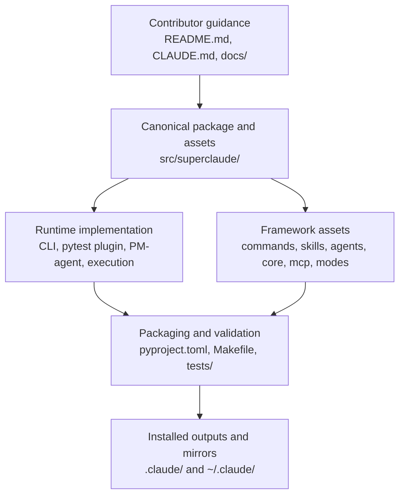
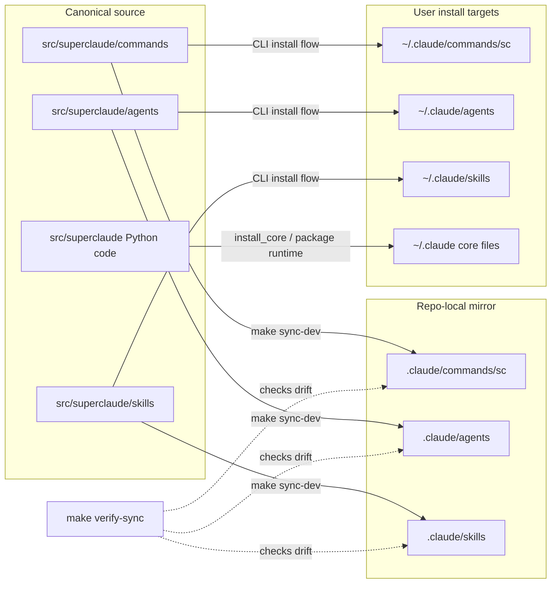
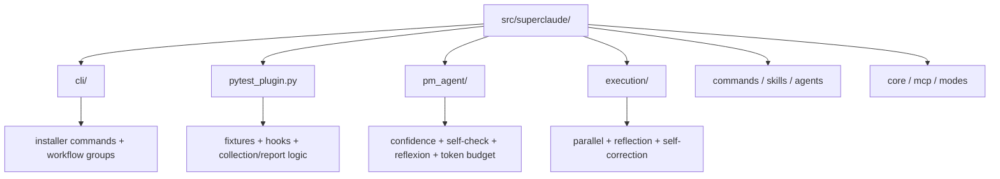
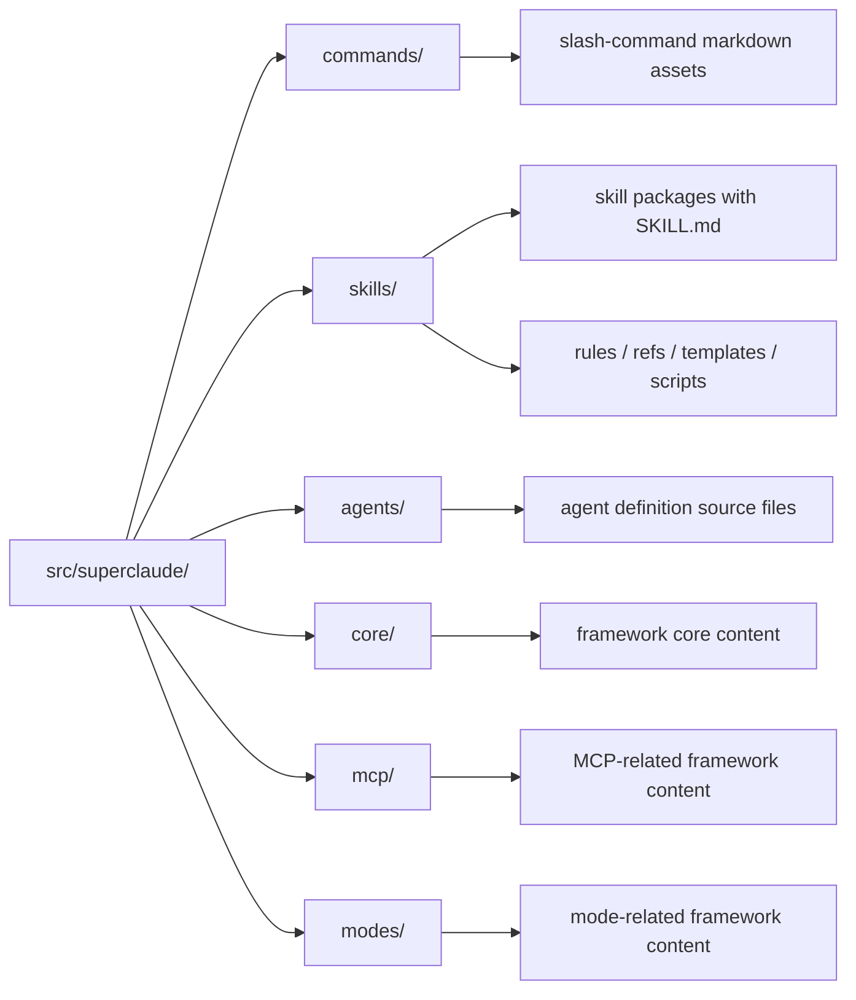
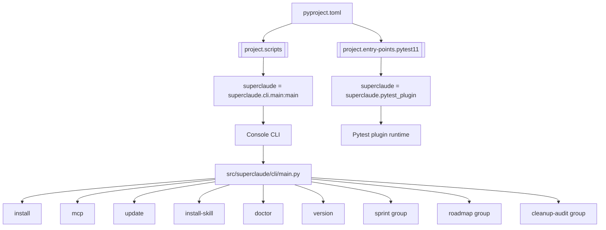
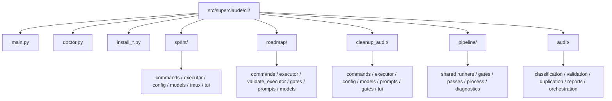
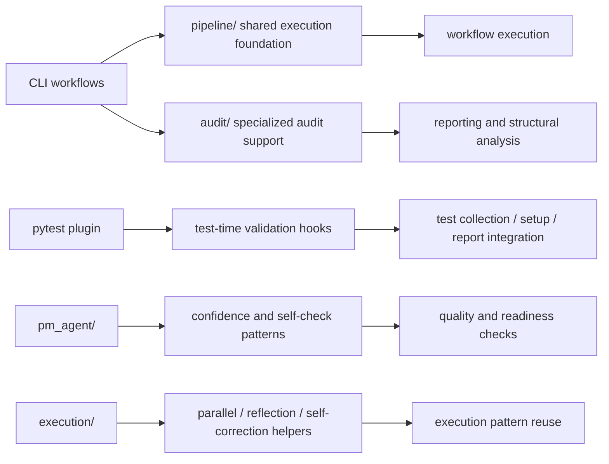
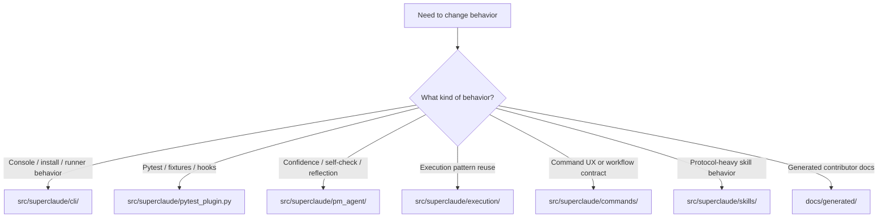

# Architecture Guide

This guide explains the current repository architecture of `SuperClaude_Framework` from a contributor perspective.

It is grounded in the current repository state, especially:
- `src/superclaude/`
- `pyproject.toml`
- `Makefile`
- `CLAUDE.md`
- generated contributor docs in `docs/generated/contributor-knowledge-base/`

If older prose conflicts with the current tree, prefer the current code and current repo instructions.

## Table of contents

- [Architecture in one view](#architecture-in-one-view)
- [Source-of-truth model](#source-of-truth-model)
- [Core architectural layers](#core-architectural-layers)
- [Runtime-facing package architecture](#runtime-facing-package-architecture)
- [Framework asset architecture](#framework-asset-architecture)
- [CLI-centered architecture](#cli-centered-architecture)
- [Execution and validation architecture](#execution-and-validation-architecture)
- [Contributor implications](#contributor-implications)
- [Mermaid readability notes](#mermaid-readability-notes)

## Architecture in one view

At a practical level, contributors can think about the repository as four connected layers:

## Source-of-truth model

The most important structural rule documented in the repository is:
- `src/superclaude/` is the canonical source for distributable components
- `.claude/` contains repo-local development copies consumed directly by Claude Code during local iteration

That means contributor edits should generally start in `src/superclaude/` and only flow into `.claude/` through the documented sync path.

## Core architectural layers

### 1. Contributor and process layer
This layer includes:
- `README.md`
- `CLAUDE.md`
- curated docs under `docs/`
- process and release materials under `.dev/`

Its job is to explain how the repository should be used and changed.

### 2. Canonical package and asset layer
This is `src/superclaude/`, which contains both:
- executable Python package code
- shipped framework assets like commands, skills, and agents

### 3. Runtime and integration layer
This includes the Python implementation surfaces contributors most often touch:
- CLI package
- pytest plugin
- PM-agent modules
- execution helpers

### 4. Packaging, sync, and validation layer
This includes:
- `pyproject.toml`
- `Makefile`
- `tests/`
- installer modules in `src/superclaude/cli/`

## Runtime-facing package architecture

The runtime-facing part of the package is broader than some older docs suggest.

### CLI layer
Observed in `src/superclaude/cli/`.

Current top-level command functions exported from `main.py` include:
- `main`
- `install`
- `mcp`
- `update`
- `install_skill`
- `doctor`
- `version`

The CLI tree also contains larger workflow subsystems:
- `sprint/`
- `roadmap/`
- `cleanup_audit/`
- `pipeline/`
- `audit/`

### Pytest plugin layer
Observed in `src/superclaude/pytest_plugin.py`.

Observed functions include:
- `pytest_configure`
- `confidence_checker`
- `self_check_protocol`
- `reflexion_pattern`
- `token_budget`
- `pm_context`
- `pytest_runtest_setup`
- `pytest_runtest_makereport`
- `pytest_report_header`
- `pytest_collection_modifyitems`

This makes the pytest plugin a first-class integration surface, not just a test helper.

### PM-agent layer
Observed in `src/superclaude/pm_agent/`.

Key modules:
- `confidence.py`
- `self_check.py`
- `reflexion.py`
- `token_budget.py`

These match the repository’s documented operating model of confidence-first work, evidence-based validation, learning/reflection, and token budgeting.

### Execution support layer
Observed in `src/superclaude/execution/`.

Key modules:
- `parallel.py`
- `reflection.py`
- `self_correction.py`

This layer appears to capture reusable execution and iteration patterns.

## Framework asset architecture

The repository ships framework assets alongside Python code.

### Commands
Observed in `src/superclaude/commands/`.

This tree contains a large set of markdown-defined commands, including:
- `implement.md`
- `analyze.md`
- `build.md`
- `document.md`
- `research.md`
- `task-unified.md`
- `cleanup-audit.md`
- `index.md`
- `index-repo.md`
- `roadmap.md`
- and many others

### Skills
Observed in `src/superclaude/skills/`.

The repo includes both user-facing and protocol-style skills, for example:
- `confidence-check/`
- `sc-task-unified-protocol/`
- `sc-cli-portify-protocol/`
- `sc-roadmap-protocol/`
- `sc-cleanup-audit-protocol/`
- `sc-adversarial-protocol/`
- `sc-review-translation-protocol/`

Many skill packages include a mix of:
- `SKILL.md`
- `__init__.py`
- `rules/`
- `templates/`
- `refs/`
- `scripts/`
- YAML configuration artifacts

### Agents
The source tree and docs indicate agent assets are also part of the distributable framework model, even though the current codebase is broader than an agents-only framing.

## CLI-centered architecture

The CLI is the main console-runtime surface of the package.

A second useful view is the CLI subsystem structure:

## Execution and validation architecture

Contributors should think of execution and validation as a connected support layer rather than as isolated files.

A validation-oriented contributor reading is:
- package behavior often flows through CLI + tests + plugin hooks
- framework-asset changes often require sync/verification via `make sync-dev` and `make verify-sync`
- generated-doc changes require path/link/claim validation against the live tree

## Contributor implications

When changing the system:
- packaging concerns often flow through `pyproject.toml` and `src/superclaude/cli/`
- test/plugin concerns often flow through `src/superclaude/pytest_plugin.py` and `tests/`
- framework content changes often flow through `src/superclaude/commands/`, `src/superclaude/skills/`, and agent assets
- local Claude Code development behavior may require corresponding `.claude/` sync validation

A useful decision shortcut is:

## Mermaid readability notes

When reading these diagrams in GitHub markdown:
- prefer zooming the page instead of copying diagrams into external renderers first
- follow left-to-right or top-to-bottom flow one section at a time
- use the section heading and nearby bullets as the legend for each diagram
- when a diagram feels dense, jump to the linked detailed doc instead of treating the diagram as a full specification

Authoring guidance used in this generated bundle:
- one diagram per architectural question
- avoid overloading a single graph with every subsystem
- keep labels tied to real repo paths and current entry points
- prefer current code over older prose when diagramming relationships
