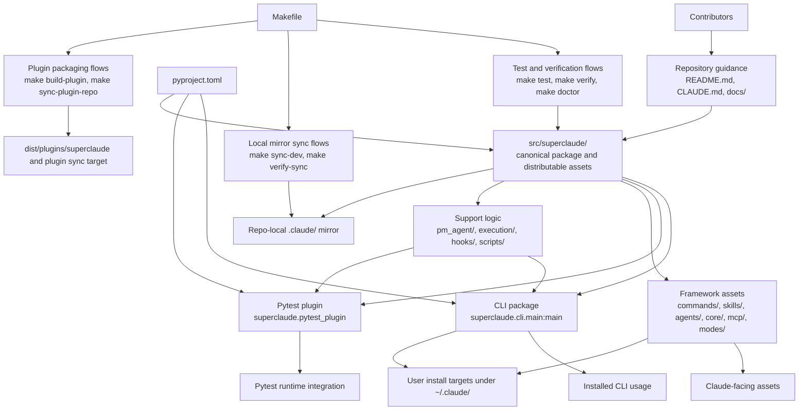
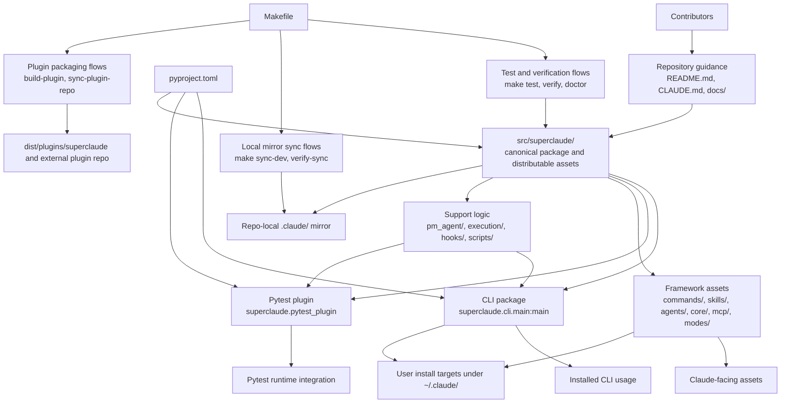
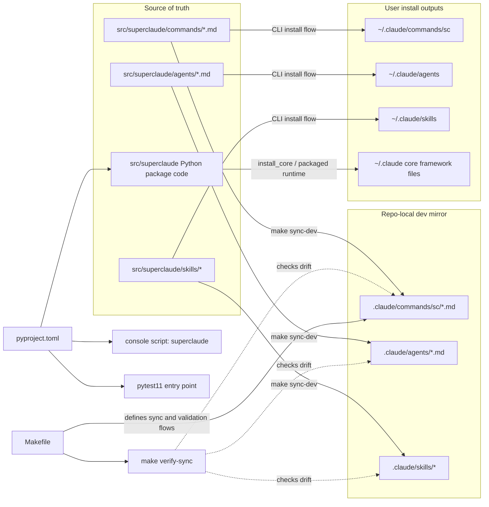
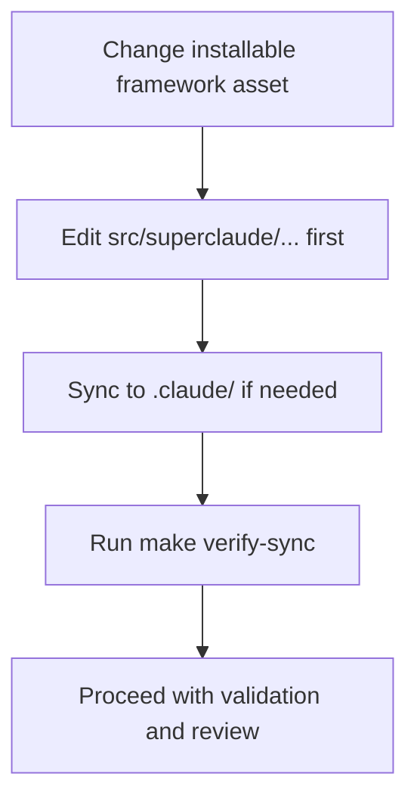
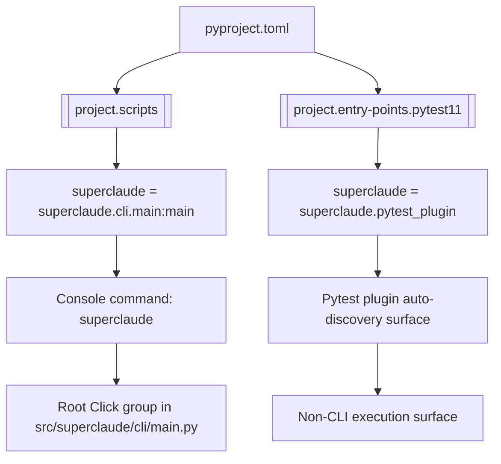
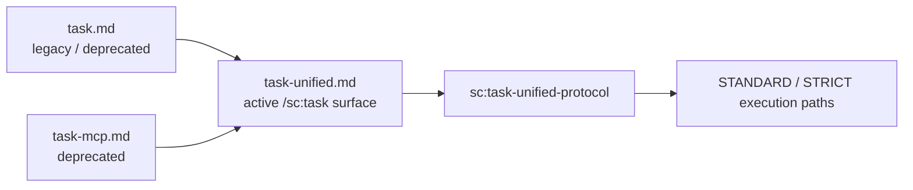
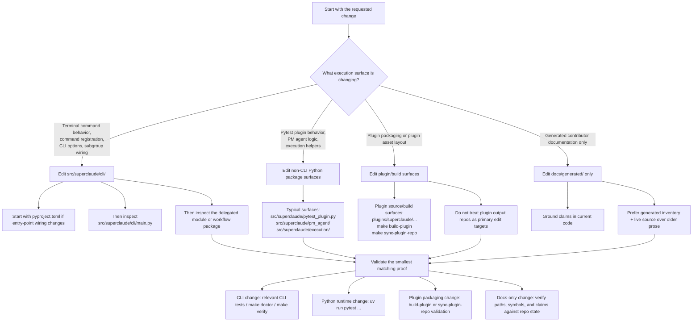
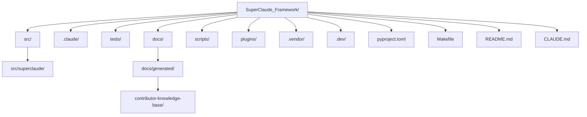

# Visual Architecture Summary

This page is a contributor-facing visual map of the current `SuperClaude_Framework` repository.

It is grounded in the current repository state observed in:
- `pyproject.toml`
- `CLAUDE.md`
- `Makefile`
- `src/superclaude/`
- the generated contributor bundle in `docs/generated/contributor-knowledge-base/`

If older prose elsewhere in the repo conflicts with the current tree, prefer the current code and current repo instructions. In particular, some older docs describe the project primarily as a context-file framework; the current repository is broader and includes a substantial Python package, CLI subsystem, pytest plugin, and packaged framework assets.

## Table of contents

- [One-screen orientation](#one-screen-orientation)
- [High-level system architecture](#high-level-system-architecture)
- [Source-of-truth vs dev-mirror relationships](#source-of-truth-vs-dev-mirror-relationships)
- [Console entry points](#console-entry-points)
- [Major component map](#major-component-map)
- [CLI runner and subsystem map](#cli-runner-and-subsystem-map)
- [Protocol-backed command relationships](#protocol-backed-command-relationships)
- [Unified planning pipeline](#unified-planning-pipeline)
- [Roadmap and adversarial integration flow](#roadmap-and-adversarial-integration-flow)
- [Adversarial workflow as a reusable protocol](#adversarial-workflow-as-a-reusable-protocol)
- [Task, roadmap, and tasklist compliance alignment](#task-roadmap-and-tasklist-compliance-alignment)
- [Audit, recommendation, and review-translation orchestration family](#audit-recommendation-and-review-translation-orchestration-family)
- [PM and validation support flows](#pm-and-validation-support-flows)
- [Task-surface deprecation map](#task-surface-deprecation-map)
- [Choosing the right change surface](#choosing-the-right-change-surface)
- [Repository map outside the package](#repository-map-outside-the-package)
- [Where to go next](#where-to-go-next)
- [Mermaid readability and style notes](#mermaid-readability-and-style-notes)
- [Current-state notes for contributors](#current-state-notes-for-contributors)

## One-screen orientation



## High-level system architecture

SuperClaude currently operates as a layered repository, not just a prompt/config bundle. The codebase centers on `src/superclaude/` as the canonical package and asset source, with packaging, test integration, local dev mirrors, and install outputs branching from that core.



## Source-of-truth vs dev-mirror relationships

The current repository instructions are explicit: `src/superclaude/` is the source of truth for distributable components, while `.claude/` contains development-facing mirror copies used directly by Claude Code during local iteration.

This repository also has a second distribution surface: user install targets under `~/.claude/`, reached through the package CLI and install flow.



### Practical rule



## Console entry points

The package has two executable registration surfaces defined in `pyproject.toml`:
- `superclaude` in `[project.scripts]` is the terminal-facing CLI entry point.
- `superclaude` in `[project.entry-points.pytest11]` is a pytest discovery surface, not a terminal command.

Only the console-script path leads into `src/superclaude/cli/main.py`.



## Major component map

At contributor level, the most useful map is the component layout inside `src/superclaude/`. The current tree shows a broader implementation surface than older docs sometimes suggest.

```mermaid
flowchart TB
    ROOT[src/superclaude/]

    ROOT --> CLI[cli/]
    ROOT --> PYTEST[pytest_plugin.py]
    ROOT --> PM[pm_agent/]
    ROOT --> EXEC[execution/]
    ROOT --> CMD[commands/]
    ROOT --> SKILLS[skills/]
    ROOT --> AGENTS[agents/]
    ROOT --> CORE[core/]
    ROOT --> MCP[mcp/]
    ROOT --> MODES[modes/]
    ROOT --> HOOKS[hooks/]
    ROOT --> SCRIPTS[scripts/]
    ROOT --> EXAMPLES[examples/]

    CLI --> CLI_MAIN[main.py<br/>root Click group]
    CLI --> CLI_DOCTOR[doctor.py]
    CLI --> CLI_INSTALL[install_core.py<br/>install_commands.py<br/>install_agents.py<br/>install_skill.py<br/>install_skills.py<br/>install_mcp.py]
    CLI --> CLI_SPRINT[sprint/]
    CLI --> CLI_ROADMAP[roadmap/]
    CLI --> CLI_CLEANUP[cleanup_audit/]
    CLI --> CLI_PIPELINE[pipeline/]
    CLI --> CLI_AUDIT[audit/]

    PYTEST --> FIXTURES[pytest fixtures and hooks]
    PM --> PM_FILES[confidence.py<br/>self_check.py<br/>reflexion.py<br/>token_budget.py]
    EXEC --> EXEC_FILES[parallel.py<br/>reflection.py<br/>self_correction.py]

    CMD --> CMD_DESC[markdown slash-command assets]
    SKILLS --> SKILLS_DESC[skill packages with SKILL.md<br/>rules, templates, refs, scripts]
    AGENTS --> AGENTS_DESC[agent definition markdown]
    CORE --> CONTENT[framework content layers]
    MCP --> CONTENT
    MODES --> CONTENT
```



## CLI runner and subsystem map

The current command registration shape in `src/superclaude/cli/main.py` separates thin command wiring from the runner and subsystem modules those commands delegate to.

```mermaid
flowchart TD
    A[Console script: superclaude] --> B[src/superclaude/cli/main.py<br/>Click root group: main]

    B --> C[install]
    B --> D[mcp]
    B --> E[update]
    B --> F[install-skill]
    B --> G[doctor]
    B --> H[version]
    B --> I[sprint group]
    B --> J[roadmap group]
    B --> K[cleanup-audit group]

    C --> C1[install_core.py]
    C --> C2[install_commands.py]
    C --> C3[install_agents.py]
    C --> C4[install_skill.py<br/>list_available_skills]
    C --> C5[install_skills.py]

    D --> D1[install_mcp.py]

    E --> E1[install_core.py]
    E --> E2[install_commands.py]
    E --> E3[install_agents.py]
    E --> E4[install_skills.py]

    F --> F1[install_skill.py<br/>install_skill_command]

    G --> G1[doctor.py<br/>run_doctor]
    G1 --> G2[_check_pytest_plugin]
    G1 --> G3[_check_agents_installed]
    G1 --> G4[_check_skills_installed]
    G1 --> G5[_check_configuration]

    H --> H1[package __version__]

    I --> I1[src/superclaude/cli/sprint/]
    I1 --> I2[commands.py]
    I1 --> I3[executor.py]
    I1 --> I4[config.py / models.py / tmux.py / monitor.py / tui.py]

    J --> J1[src/superclaude/cli/roadmap/]
    J1 --> J2[commands.py]
    J1 --> J3[executor.py]
    J1 --> J4[validate_executor.py]
    J1 --> J5[models.py / gates.py / prompts.py]

    K --> K1[src/superclaude/cli/cleanup_audit/]
    K1 --> K2[commands.py]
    K1 --> K3[executor.py]
    K1 --> K4[config.py / models.py / gates.py / prompts.py / monitor.py / tui.py]
    K1 --> K5[audit/ support library]

    I1 --> P[pipeline/ shared execution surface]
    J1 --> P
    K1 --> P
```



## Protocol-backed command relationships

The current repository has a clear split between thin command entry points in `src/superclaude/commands/` and protocol-heavy skills in `src/superclaude/skills/`.

For contributors, the key distinction is:
- command files define invocation UX, flags, boundaries, and when to delegate
- skill packages define the real multi-step workflow
- some commands remain command-defined and do not currently map to a dedicated skill package

```mermaid
flowchart LR
    subgraph Commands[Protocol-backed /sc commands]
        C1[/sc:roadmap]
        C2[/sc:tasklist]
        C3[/sc:task]
        C4[/sc:adversarial]
        C5[/sc:cleanup-audit]
        C6[/sc:recommend]
        C7[/sc:review-translation]
        C8[/sc:pm]
        C9[/sc:validate-tests]
    end

    subgraph Skills[Backing skills / protocols]
        S1[sc:roadmap-protocol]
        S2[sc:tasklist-protocol]
        S3[sc:task-unified-protocol]
        S4[sc:adversarial-protocol]
        S5[sc:cleanup-audit-protocol]
        S6[sc:recommend-protocol]
        S7[sc:review-translation-protocol]
        S8[sc:pm-protocol]
        S9[sc:validate-tests-protocol]
    end

    C1 --> S1
    C2 --> S2
    C3 -->|STANDARD / STRICT| S3
    C4 --> S4
    C5 --> S5
    C6 --> S6
    C7 --> S7
    C8 --> S8
    C9 --> S9
```

### Important note

`/sc:task` is special: the command performs tier classification first, then only STANDARD and STRICT paths invoke `sc:task-unified-protocol`; LIGHT and EXEMPT remain command-handled.

## Unified planning pipeline

The active planning pipeline is staged, not automatic. `sc:roadmap-protocol` produces planning artifacts, after which the user may later run `/sc:tasklist`, and then later execute work through `/sc:task`.

```mermaid
flowchart TD
    A[Specification file(s)] --> B[/sc:roadmap]
    B --> C[sc:roadmap-protocol]

    C --> C1[Wave 0: prerequisites]
    C1 --> C2[Wave 1A: spec consolidation optional]
    C2 --> C3[Wave 1B: extraction + scoring]
    C3 --> C4[Wave 2: planning + template selection]
    C4 --> C5[Wave 3: generate roadmap artifacts]
    C5 --> C6[Wave 4: validation]

    C6 --> D[roadmap.md + extraction.md + test-strategy.md]

    D --> E[/sc:tasklist]
    E --> F[sc:tasklist-protocol]
    F --> G[tasklist-index.md + phase-N-tasklist.md bundle]

    G --> H[User selects task]
    H --> I[/sc:task]
    I --> J[Command-level tier classification]
    J -->|EXEMPT / LIGHT| K[Direct execution in command flow]
    J -->|STANDARD / STRICT| L[sc:task-unified-protocol]
    L --> M[Tiered execution + verification routing]
```

## Roadmap and adversarial integration flow

`sc:roadmap-protocol` can call `sc:adversarial-protocol` in two different places: for multi-spec consolidation and for multi-roadmap generation.

```mermaid
flowchart TD
    A[/sc:roadmap] --> B[sc:roadmap-protocol]

    B --> C{Mode?}
    C -->|Single spec| D[Wave 1B extraction]
    C -->|--specs| E[Wave 1A invoke sc:adversarial-protocol<br/>for spec consolidation]
    C -->|--multi-roadmap or --agents| F[Wave 2 invoke sc:adversarial-protocol<br/>for roadmap variant generation + merge]

    E --> G[Unified spec]
    G --> D

    D --> H[Template selection / milestone planning]
    F --> I[Merged roadmap source]
    I --> J[Skip template-based generation path]

    H --> K[Wave 3 generation]
    J --> K
    K --> L[Wave 4 validation]
    L --> M[roadmap.md / extraction.md / test-strategy.md]
```

## Adversarial workflow as a reusable protocol

`sc:adversarial-protocol` is best understood as a reusable merge-and-pressure-test engine. The standalone `/sc:adversarial` command is one entry point, but the protocol also supports higher-level workflows such as roadmap generation.

```mermaid
flowchart TD
    A[/sc:adversarial] --> B[sc:adversarial-protocol]

    B --> C{Input mode}
    C -->|Mode A| D[Compare existing files]
    C -->|Mode B| E[Generate variants from source]
    C -->|Pipeline mode| F[Multi-phase DAG]

    D --> G[Step 1: diff-analysis.md]
    E --> G
    F --> G

    G --> H[Step 2: debate-transcript.md]
    H --> I[Step 3: base-selection.md]
    I --> J[Step 4: refactor-plan.md]
    J --> K[Step 5: merge-log.md + merged output]

    K --> L[Reusable output for calling workflows]
    L --> M[roadmap multi-spec / multi-roadmap]
    L --> N[tasklist sprint input]
    L --> O[design/spec comparison families]
```

## Task, roadmap, and tasklist compliance alignment

`/sc:tasklist` and `/sc:task` should be understood as adjacent but distinct compliance surfaces. If contributors change task tier logic, they should think about both the emitted tasklists and the downstream execution rules.

```mermaid
flowchart LR
    A[roadmap.md] --> B[/sc:tasklist]
    B --> C[sc:tasklist-protocol]

    C --> D[Deterministic phase/task generation]
    D --> E[Tier classification per task]
    E --> F[Verification method per tier]
    F --> G[Sprint-compatible tasklist bundle]

    G --> H[/sc:task]
    H --> I[Command classification header]
    I --> J[Tier-specific execution path]

    J --> K[STRICT -> sub-agent verification]
    J --> L[STANDARD -> direct test execution]
    J --> M[LIGHT -> quick sanity check]
    J --> N[EXEMPT -> no verification overhead]
```

## Audit, recommendation, and review-translation orchestration family

These flows are all protocol-backed, but they operate at different layers:
- `/sc:recommend` recommends command sequences and flags; it does not execute them
- `/sc:cleanup-audit` is a read-only multi-pass audit that writes reports only
- `/sc:review-translation` is a staged localization review system with a confirmation gate and adversarial validation

```mermaid
flowchart TD
    subgraph Recommend[Recommendation flow]
        R1[/sc:recommend] --> R2[sc:recommend-protocol]
        R2 --> R3[Keyword + context + expertise analysis]
        R3 --> R4[Recommended command sequences]
    end

    subgraph Audit[Repository audit flow]
        A1[/sc:cleanup-audit] --> A2[sc:cleanup-audit-protocol]
        A2 --> A3[Pass 1: surface scan]
        A3 --> A4[Pass 2: structural audit]
        A4 --> A5[Pass 3: cross-cutting comparison]
        A5 --> A6[Validator + consolidator]
        A6 --> A7[.claude-audit reports]
    end

    subgraph Translation[Localization review flow]
        T1[/sc:review-translation] --> T2[sc:review-translation-protocol]
        T2 --> T3[Phase 0: file detection + validation]
        T3 --> T4[Phase 1: context analysis + user confirmation gate]
        T4 --> T5[Phase 3: parallel per-language review]
        T5 --> T6[Phase 4: adversarial validation + evidence search]
        T6 --> T7[Phase 5-7: reports + summary + implementation options]
    end
```

## PM and validation support flows

This is support infrastructure rather than a primary user workflow chain. `/sc:pm` manages continuity and orchestration patterns across sessions, while `/sc:validate-tests` is specialized self-validation for task classification behavior.

```mermaid
flowchart LR
    A[/sc:pm] --> B[sc:pm-protocol]
    B --> C[Session restore from memory]
    C --> D[PDCA work cycle]
    D --> E[Sub-agent orchestration patterns]
    E --> F[Checkpoint + memory writeback]

    G[/sc:validate-tests] --> H[sc:validate-tests-protocol]
    H --> I[Load YAML behavioral test specs]
    I --> J[Run tier-classification logic]
    J --> K[Compare expected vs actual]
    K --> L[Validation report]
```

## Task-surface deprecation map

Current task workflow documentation should treat `task-unified` as the primary active surface.



## Choosing the right change surface

This decision path is especially useful for contributors working across CLI, plugin, runtime, and generated-doc boundaries.



## Repository map outside the package



## Where to go next

Use this page as the hub, then jump to the generated document that matches your question:

- [README for this generated bundle](./README.md) — audience, scope, and reading order
- [Repository Overview](./repository-overview.md) — top-level layout and repository identity
- [Architecture Guide](./architecture-guide.md) — layered architecture and current-code interpretation
- [Components Guide](./components-guide.md) — subsystem-by-subsystem contributor map
- [Contributor Workflow Guide](./contributor-workflow.md) — how to work safely in the repo
- [CLI API Inventory](./cli-api-inventory.md) — module-by-module CLI package inventory
- [Commands and Skills Cross-Reference](./commands-skills-cross-reference.md) — command/protocol relationship map

## Mermaid readability and style notes

When reading these diagrams in GitHub markdown:
- use the table of contents to navigate one diagram section at a time
- treat the heading and nearby bullets as the legend for each graph
- zoom the page rather than copying diagrams out immediately
- jump to the linked detailed document when a diagram is summarizing too much at once

Authoring guidance used in this generated bundle:
- one diagram per architectural question
- avoid overloading a single graph with every subsystem
- keep node labels tied to real repo paths and current entry points
- prefer current code over older prose when diagramming relationships
- use top-to-bottom for layered systems and left-to-right for source/flow comparisons

## Current-state notes for contributors

- Current package metadata identifies `superclaude` version `4.2.0` with Python `>=3.10`.
- Current executable entry points are the CLI (`superclaude.cli.main:main`) and pytest plugin (`superclaude.pytest_plugin`).
- Current code shows a larger CLI tree than some older docs imply, including `sprint`, `roadmap`, `cleanup_audit`, `pipeline`, and `audit` subsystems.
- Current protocol-backed command families include roadmap, tasklist, task-unified, adversarial, cleanup-audit, recommend, review-translation, pm, and validate-tests.
- For conflicts between older architecture prose and the present tree, prefer `src/superclaude/`, `pyproject.toml`, `CLAUDE.md`, and `Makefile`.
