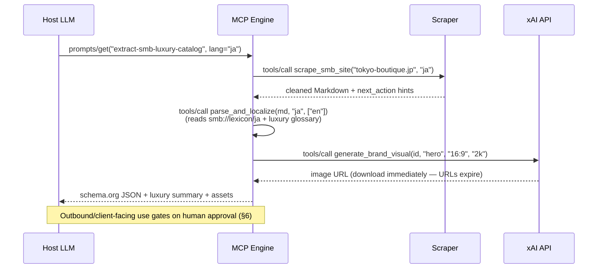

# Luxury SMB MCP Engine — Architecture Specification v2

**Status**: Draft for review · **Date**: 2026-07-21
**Supersedes**: v1 concept ("MCP luxury engine + Grok Imagine" draft)
**API facts verified against**: [docs.x.ai](https://docs.x.ai) official reference (see §2)

---

## 1. Executive Summary

An MCP-based orchestration engine that scrapes, normalizes, and localizes small-business (SMB) data across 10 trading languages, then generates brand-matched visual assets via the xAI Grok Imagine API — end to end, from a public URL to a localized catalog with imagery.

**What changed from v1:**

| Change | Why |
|---|---|
| Grok Imagine claims corrected against official docs | v1 contained wrong pricing, a nonexistent `size` param, and overstated video capabilities |
| Pipeline redesigned from 9 steps to 5 | Lean Six Sigma pass — three merge points eliminated waiting/handoff waste (§5) |
| Visual generation modeled as first-class MCP tools | v1 bolted the image API onto the side; v2 composes it with the extraction workflow |
| Trademark/likeness risk flagged as an open legal item | xAI's AUP has only general IP language — no explicit rule for third-party brand marketing imagery |

---

## 2. Verified Grok Imagine API Fact Sheet

Every claim from the v1 draft, checked against official xAI documentation (2026-07-21):

| v1 claim | Verdict | Reality |
|---|---|---|
| Endpoint `POST /v1/images/generations` | ✅ Verified | Plus `/v1/images/edits`, `/v1/videos/generations` (async + `GET /v1/videos/{request_id}` polling), `/v1/videos/edits`, `/v1/videos/extensions` |
| Models `grok-imagine-image`, `grok-imagine-video-1.5` | ✅ Verified | Also `grok-imagine-image-quality` ($0.05 tier, used in docs examples) and `grok-imagine-video` (standard tier) |
| `aspect_ratio: "16:9"` parameter | ✅ Verified | Valid. Images also take `n` (≤10), `resolution` (`1k`/`2k`), `response_format`. **There is no OpenAI-style `size` param** |
| Image price $0.02–$0.05 | ✅ Verified | $0.02 (`grok-imagine-image`) / $0.05 (`-quality`), flat per image |
| Video price $0.02–$0.05/sec | ❌ **Corrected** | **$0.050/sec** (`grok-imagine-video`) / **$0.080/sec** (`-1.5`) |
| Up to 3 reference images | ✅ Verified | Via `/v1/images/edits` — combine subjects, transfer styles, compose scenes |
| Object swapping/editing | ⚠️ Partially | Editing is prompt-driven; "object swap" is not documented terminology — treat as an inferred use |
| 1080p image-to-video | ✅ With caveat | **1080p only on `grok-imagine-video-1.5` image-to-video**; text-to-video maxes at 720p; default 480p |
| Native timed audio | ✅ With caveat | Marketed ("synchronized audio") but **no audio parameter exists** — automatic, not configurable |
| — (not in v1) | ➕ Limits | Video 1–15 s (edits ≤8.7 s); rate limits ~5 req/s (image) / 10 req/s (video); output URLs are temporary — download promptly |
| — (not in v1) | ➕ Auth/SDK | `Authorization: Bearer $XAI_API_KEY`; official `xai_sdk` (Python), OpenAI-SDK-compatible via `base_url="https://api.x.ai/v1"` |

---

## 3. MCP Architecture

Three protocol primitives, four workflows (extraction, normalization, localization, **visual generation** — new in v2).

### 3.1 Resources (read-only context)

| Resource URI | Content |
|---|---|
| `smb://schema/business` | JSON-LD / schema.org business metadata schema (catalog, inventory, localized pricing, hours, contacts) |
| `smb://lexicon/{lang}` | Per-language lexicon: translation rules, currency tables, luxury/artisan terminology — 10 trading languages (zh, es, en, ar, ja, de, fr, pt, hi, it) |
| `smb://data/{business_id}/catalog` | Latest cleaned scrape snapshot (Markdown), with provenance + timestamp |
| `smb://brand/{business_id}/profile` | **New**: extracted brand profile — palette, aesthetic keywords, tone descriptors — feeds visual prompts |

### 3.2 Tools (JSON-RPC actions)

| Tool | Contract | Notes |
|---|---|---|
| `scrape_smb_site(domain, lang, page?)` | → cleaned Markdown + structural metadata | Headless (Playwright), geo-headers, DOM noise stripping **before** LLM ingestion (token cost ↓) |
| `parse_and_localize(markdown, source_lang, target_langs[])` | → schema.org JSON in all requested languages | **Merged tool** (v1 had separate parse + translate — see §5); cross-references `smb://lexicon/*` in one pass |
| `generate_brand_visual(business_id, kind, aspect_ratio, resolution)` | → image URL(s) | Wraps `POST /v1/images/generations`; prompt built from `smb://brand/{id}/profile`; `grok-imagine-image` for drafts ($0.02), `-quality` for client-facing ($0.05) |
| `compose_brand_visual(business_id, reference_images[≤3], prompt)` | → image URL | Wraps `/v1/images/edits` — style transfer from the client's real product photos (≤3 refs, per docs) |
| `generate_brand_video(business_id, image_url, duration≤15, resolution)` | → request_id → poll → video URL | Wraps async `/v1/videos/generations`; **image-to-video on `-1.5` for 1080p**; audio is automatic |

### 3.3 Prompts (reusable workflows)

| Prompt | Role |
|---|---|
| `extract-smb-luxury-catalog(lang)` | Full pipeline entry: scrape → parse/localize → brand profile refresh |
| `luxury-tone-guide(lang)` | Tone constraints per language so summaries read as premium copy, not machine translation |
| `visual-pitch-pack(business_id, lang)` | Catalog + 3 hero images + one 10 s video, assembled for a sales deck |

**Adaptive tool responses** (kept from v1 — it's a good pattern): every tool result carries a `next_action` hint, e.g. `"Parsed 12 products; 3 missing prices → call scrape_smb_site(page='/pricing')"`.

---

## 4. Execution Workflow

---

## 5. Lean Six Sigma: Step Reduction

Value-stream comparison of one "URL in → localized catalog + visuals out" cycle:

### Current state (v1 design) — 9 steps, 4 handoffs

| # | Step | Waste (Muda) |
|---|---|---|
| 1 | Scrape site | — |
| 2 | Clean DOM output | *Merged into 1 (defect-prevention at source)* |
| 3 | Parse entities | — |
| 4 | Look up lexicon | *Waiting — separate Resource round-trip per language* |
| 5 | Translate catalog | *Rework — re-tokenizes text step 3 already processed* |
| 6 | Extract brand keywords | *Motion — re-reads scrape output* |
| 7 | Hand off to design/prompt step | *Handoff* |
| 8 | Generate visuals | — |
| 9 | Assemble + QA | — |

### Future state (v2) — 5 steps

| # | Step | Eliminates |
|---|---|---|
| 1 | `scrape_smb_site` (cleaning built in) | v1 steps 1–2 |
| 2 | `parse_and_localize` (lexicon pre-cached as Resource; parse+translate in one model pass) | v1 steps 3–5 |
| 3 | Brand profile refresh (side effect of step 2 → `smb://brand/{id}/profile`) | v1 step 6 |
| 4 | `generate_brand_visual` / `generate_brand_video` (prompt template reads the profile Resource — no human design handoff) | v1 steps 7–8 |
| 5 | Assemble + human approval gate | v1 step 9 (QA folded into the HITL gate that must exist anyway, §6) |

**Measured levers**: 9→5 steps (−44%), 4→1 handoffs; token cost per cycle drops from double-tokenization of the catalog text to single-pass; lexicons served as cached MCP Resources instead of per-call lookups.

**Six Sigma control**: track defects-per-cycle (missing prices, mistranslated terms, off-brand visuals rejected at the gate) as the DPMO metric; the adaptive `next_action` hints are the andon cord — they surface incomplete extractions immediately rather than at final QA.

---

## 6. Guardrails

- **Reads run free, writes gate on humans**: scraping, parsing, and draft generation are automatic; anything outbound (client emails, published assets, paid `-quality`/video renders above a budget threshold) requires MCP elicitation / human approval.
- **Moderation**: xAI applies server-side moderation (`respect_moderation` response field); design for rejected generations as a normal branch, not an error.
- **⚠️ Trademark/likeness (open legal item)**: xAI's Acceptable Use Policy prohibits IP violations, impersonation, and watermark removal in general terms, but has **no explicit rule** about generating imagery for third-party brands as a service. Generating visuals *for a client using that client's own brand* with consent is the defensible pattern; generating competitor or celebrity-adjacent imagery is not. Get counsel review before commercial launch.
- **Provenance**: keep xAI watermarks/provenance signals intact (removal is explicitly prohibited); store generation params alongside assets for auditability.

## 7. Cost Model (verified pricing)

Per business, per full refresh cycle (catalog + 3 hero images + one 10 s 1080p video):

| Item | Unit cost | Qty | Cost |
|---|---|---|---|
| Draft images (`grok-imagine-image`) | $0.02 | 6 | $0.12 |
| Final images (`-quality`) | $0.05 | 3 | $0.15 |
| Video (`grok-imagine-video-1.5`, 10 s) | $0.08/s | 10 s | $0.80 |
| **Visual assets total** | | | **≈ $1.07** + LLM tokens |

At ~$1/cycle for visuals, the marginal-cost-collapse thesis holds — but rate limits (~5 img req/s) mean 100x scale-out needs request queuing, not just parallel calls.

## 8. Valuation Levers (tied to §5 metrics)

1. **Marginal cost collapse** — design labor → ~$1.07/cycle API spend (§7); gross margin expands with volume
2. **CAC reduction** — public-data → personalized pitch pack with zero human design steps (§5 future-state step 4); shortens sales cycles
3. **Scale without headcount** — 5-step automated pipeline per sub-brand; headcount-flat output growth is what moves the earnings multiple
4. **Defensibility** — the per-language luxury lexicons (`smb://lexicon/*`) are the accumulating asset generic scrapers can't replicate

## 9. Open Questions

- [ ] Legal: third-party trademark imagery policy (§6) — blocking for commercial launch
- [ ] Audio: no API control surface — is automatic audio acceptable for brand videos, or is post-production muting needed?
- [ ] Output URL expiry duration is undocumented — build immediate-download into every tool wrapper
- [ ] Per-resolution video pricing ambiguity (overview says "varies by resolution", pricing table shows flat per-model rates) — confirm before publishing client pricing
